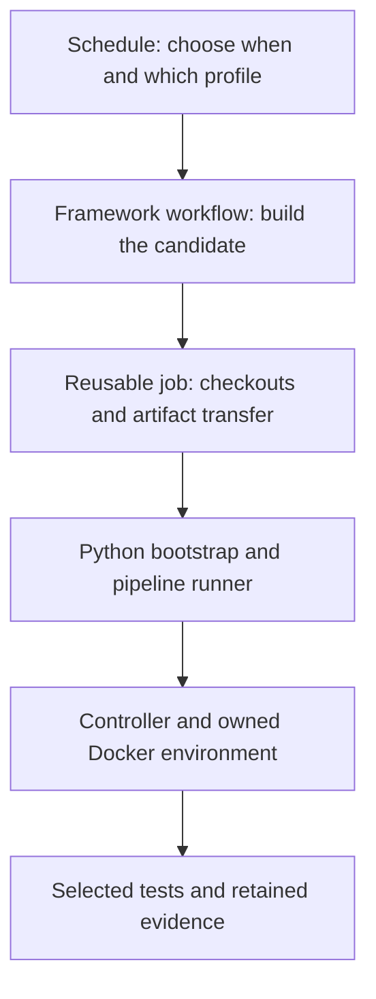

# Choose the workflow you want to change

These are the workflow files contributors edit. Choose a folder by what the job is for; choose a schedule only when you want to change when it runs.

| Folder | Start here when you want to… |
| --- | --- |
| [repository/](repository/README.md) | Check Python code, packaging, documentation, pull requests or runner status. |
| [library/](library/README.md) | Test or tune AITER itself, including native, Triton and communication paths. |
| [frameworks/](frameworks/README.md) | Exercise a consumer such as [vLLM](frameworks/vllm/README.md) or [SGLang](frameworks/sglang/README.md). |
| [release/](release/README.md) | Build, verify and promote wheel or image artifacts. |
| [reusable/](reusable/README.md) | Change a complete job shared by several workflows. |
| [schedules/](schedules/README.md) | Change a cron time or the fixed profile requested at that time. |

The [generated source index](index.md) lists every YAML file and its GitHub entrypoint. [registry.json](registry.json) owns that mapping. The Python generator remains in `ci/workflows`; the YAML sources live here.

## Follow one vLLM run

The [daily schedule](schedules/frameworks/vllm/nightly-daily.yaml) requests the `vllm-nightly` profile from [the vLLM execution workflow](frameworks/vllm/nightly.yaml). That workflow builds a candidate AITER wheel, then calls [the reusable execution job](reusable/run-profile.yaml).



The job checks out reviewed build and test instructions into `control/`, and the AITER version being evaluated into `candidate/`. Those versions can differ: a proposed library change must not silently replace its own test rules. For this example, [bootstrap.py](../../ci/pipelines/bootstrap.py) reads explicit job inputs, [runner.py](../../ci/pipelines/runner.py) selects the operation, and [nightly.py](../../ci/pipelines/nightly.py) owns fresh installation and the required import gate. The selected controller verifies the inputs, installs the candidate, checks imports and runs the selected work in its owned environment. Failed installation or import admission stops model execution. Requests, logs, results and `bootstrap.json` retain the handoff and failures.

The generic profile runner also serves AITER, PyTorch and SGLang. Rolling installation, benchmarking and specialized platform work have named controllers because they perform different operations. A SGLang upstream model run and a multi-node vLLM run retain their own declared platform requirements; the shared handoff does not make their evidence interchangeable with locked release qualification.

## Find the tests without reading YAML

A profile is a named selection of test groups. Each group declares its actual test paths, hardware, minimum case count, timeout and input requirements. Read the [CI guide](../../ci/README.md) or inspect the current declarations:

```bash
python -m ci list
python -m ci coverage --client vllm
python -m ci coverage --client sglang
python -m ci coverage --client aiter
```

Add a test to its reviewed group and profile. Change its schedule separately. The catalogs remain the source of test selection; the workflow files do not introduce another test-definition language.

## Edit and check

Edit the source in this tree, then run:

```bash
python -m ci.workflows --write
python -m ci.workflows --check
```

The generator copies each YAML source into its declared flat `.github/workflows` entrypoint with a source path and hash. It does not expand templates or rewrite jobs. Include source and generated output together. `--check` makes no writes and rejects missing mappings, stale generated files, path escapes and invalid reusable calls. Actionlint checks GitHub syntax separately. The [entrypoint index](../workflows/README.md) explains the files shown in GitHub Actions.

A configured schedule is a request to run. It still needs the declared runner, environment, artifacts and credentials. Read the [execution record](../../notes.md) for what was actually tested; this directory does not itself establish remote GPU or release operation.
