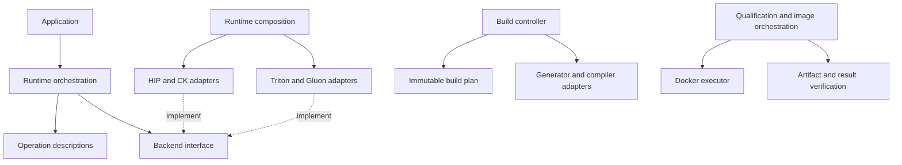
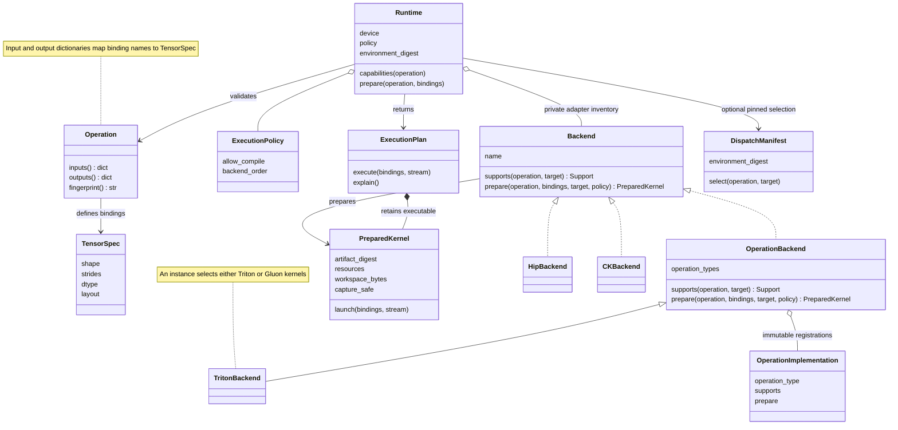
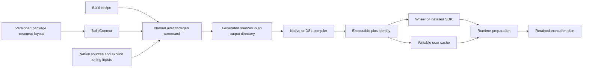
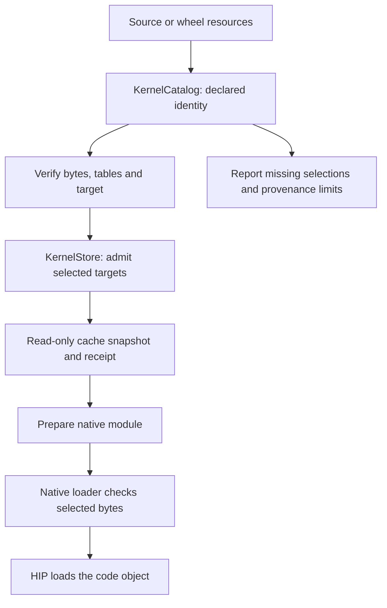
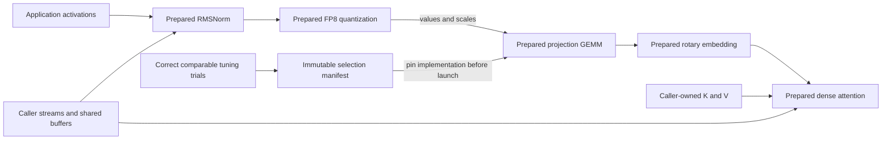
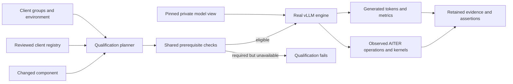
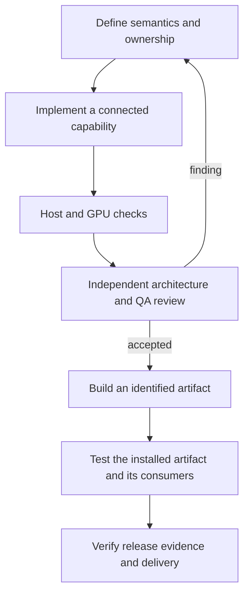

# AITER architecture

AITER is an accelerated operator SDK for ROCm. The application owns its tensors, streams and model state. AITER describes supported operations, prepares an implementation and enqueues its kernels. Its build and delivery systems make that implementation reproducible and testable across consumers.

The prepared interface follows a simple rule: **describe once, prepare before use, execute a fixed plan**. Preparation may compile when the caller permits it. Execution checks the supplied buffers and calls retained code; it does not search tuning tables, choose another backend, allocate scratch space or synchronize the GPU. Existing specialized operator interfaces keep their own documented lifecycles.

## The design pattern: ports and adapters

An operation describes what the caller needs. A small provider interface describes what an implementation must supply. HIP, CK and DSL adapters implement that interface. The runtime coordinates them through the interface. This is the **ports-and-adapters pattern**: operation semantics are at the center, while GPU implementations, compilers, packaging and CI remain replaceable at their respective boundaries.

For example, adding a backend does not require adding another branch to every runtime method. Supply an adapter with `supports` and `prepare`, then pass its instance in `Runtime(backends=...)`. The application decides which implementations exist; the runtime applies its policy to those implementations. The prepared plan retains the selected executable and its resources.

The repository is a modular system with three separate orchestration scopes:

| Scope | Where coordination belongs | What its adapters do |
| --- | --- | --- |
| Execute operations | `aiter/runtime/context.py`; built-in providers are assembled in `runtime/composition.py` | Report support, prepare native/DSL code and return a fixed launcher |
| Build an artifact | `build_backend/controller.py`, using the immutable plan in `build_backend/plan.py` | Generate sources, invoke compilers and stage the declared payload |
| Qualify and deliver | `ci/pipelines/profile.py` and `ci/pipelines/images.py` | Run isolated environments through `ci/pipelines/docker.py` and reconstruct their evidence |

Each scope has one place that assembles its dependencies and one owner for each decision. The runtime owns device execution policy; the build owns compilation phases; delivery owns which exact artifact and environment may advance. Their inputs are explicit, so tests can replace an adapter while exercising the same orchestration used in production.

## Rules that keep the structure intact

| Rule | Practical consequence |
| --- | --- |
| Dependencies point toward descriptions and interfaces | Operation descriptions remain usable without Torch; runtime orchestration does not import a concrete provider |
| Assembly is explicit | Built-in provider definitions have one source of truth, and an application gets its own adapter instances |
| Planning precedes side effects | Build phases can be inspected before execution; kernel preparation happens before capture or repeated launch |
| Compatibility stays at entry points | Existing imports forward to canonical implementations rather than duplicating their decisions |
| Framework concerns have a named home | Consumer tests, profiles and container recipes live under their framework directory |
| Evidence follows actual execution | A report identifies the artifact, controls, environment and individual results that produced it |

`python -m ci architecture check` checks dependency direction and repository placement. Its [reviewable policy](ci/architecture/policy.json) also explains each restriction. Relative imports and literal dynamic imports are checked; computed dynamic imports are listed for review. This is a static dependency check, alongside behavioral tests, rather than a claim that static analysis can resolve arbitrary Python execution. See [the architecture checks](ci/architecture/README.md) for examples and extension rules.

## The runtime model

`aiter.api` defines mathematical behavior and physical layouts without importing Torch. `aiter.runtime` validates actual bindings and applies the caller's policy. A backend reports support with a reason, then prepares a launcher for one exact operation. `ExecutionPlan.explain()` identifies the chosen backend, artifact and environment.

The runtime accepts an explicit `backends=` inventory. An application can supply another adapter without editing a global registry or importing a serving framework into AITER. Operation classes declare their own bindings, so buffer validation does not need a central list of every operation type. Backends implement the operations they understand and decline the rest.

Built-in provider definitions live in `runtime/configuration.py`; `runtime/composition.py` instantiates them. Triton and Gluon operation implementations are grouped under `backends/triton/` by operation family. A single `OperationBackend` table drives both support and preparation, so adding an implementation cannot update one dispatch switch while forgetting the other. Registration uses the exact descriptor type; a subclass with different semantics needs its own explicit registration.

Preparation validates buffer spans, layouts, devices and output overlap before entering a provider. It must preserve application data. Execution repeats the binding checks, uses the caller's stream and respects the provider's capture declaration. A rejected preparation produces an error before launch; launch failures are never retried through another provider. Plans retain executable resources so that their lifetime is explicit.

## What each directory owns

| Location | Its job |
| --- | --- |
| `aiter/api/` | Tensor descriptions, operation meanings and the complete public domain inventory |
| `aiter/runtime/` | Execution policy, support queries, preparation, binding checks and plans |
| `aiter/backends/` | HIP, CK, Triton and Gluon adapters to actual leaf kernels |
| `aiter/ops/` | Operation implementations, including `attention/`, `moe/`, `gemm/`, `position/` and `quantization/`; `_native/` contains Python launch bridges |
| `aiter/codegen/` | Named generators and an explicit context for native build resources |
| `aiter/jit/` | Native compilation, executable loading and cache identities |
| `aiter/aot/` | Compiler adapters and ahead-of-time build jobs |
| `aiter/kernels/` | Precompiled resource identity, selection-table validation and explicit cache admission; `data/` owns the delivered bytes |
| `aiter/testing/` | Reusable numerical checks, tensor factories, measurements and process helpers used by operator development |
| `aiter/tuning/` | Validated trials and immutable exact-workload selections; `search/` holds offline tuning programs |
| `aiter/dist/` | Existing communication implementations and distributed resources |
| `csrc/` | Native C/C++/HIP sources and headers; `blas/` owns the BLAS bridges used by tuning |
| `include/aiter/`, `csrc/runtime/`, `cmake/` | Public C ABI, native runtime and installed CMake SDK |
| `bindings/rust/` | Optional typed Rust frontend over that same C ABI |
| `build_backend/` | Python metadata, wheel staging, source distributions and explicit prebuild options |
| `tests/unit/` | Host checks for architecture, runtime metadata, builds, tuning, benchmarks and CI |
| `tests/integration/` | Connected GPU operations, packaging, communication, benchmark drivers and installed SDK consumers |
| `tests/frameworks/` | `pytorch/`, `vllm/`, `sglang/` and their shared `common/` helpers |
| `tests/common/` | Hardware eligibility, pytest markers, pinned model inputs, process cleanup and package-origin helpers |
| `tests/operators/` | Operator regressions grouped into HIP, Triton, FlyDSL and Opus families |
| `benchmarks/` | Operator measurements, `vllm/` real-model measurements, model-shape sweeps and `traces/` profiler analysis |
| `requirements/` | Dependency inputs grouped by runtime, build, test, documentation and client environment |
| `ci/` | Architecture rules, qualification, framework profiles, pipeline orchestration, release delivery and ownership |
| `ci/workflows/` | Python generator and validation for workflow sources |
| `.github/workflow-sources/` | Editable YAML under `repository/`, `library/`, `frameworks/`, `release/`, `reusable/` and `schedules/` |
| `.github/workflows/` | Generated entrypoints for GitHub events, job dependencies, runner allocation and credential boundaries |
| `.github/actions/` | Small reusable steps within a job |
| `.github/scripts/` | Small workflow adapters grouped under `common/`, `repository/`, `library/`, `frameworks/` and `release/` |
| `docker/` | `common/` wheelhouse/runtime/development recipes and `pytorch/`, `vllm/`, `sglang/` consumer images |

Native source directories no longer contain first-party Python programs. Generators, offline search, compiler drivers and runtime bridges each have an importable home. Their commands use package entry points rather than launching Python files found by walking parent directories.

The checkout has two application boundaries: `aiter/` is the library that consumers install, and `ci/` is the automation used to develop and qualify it. Installing the wheel does not install CI. Precompiled kernel bytes belong to the installed library under `aiter/kernels/data/`, next to the catalog and admission code that manages them. Source checkouts and wheels use the same resource path. Writable caches remain outside both.

Workflow authors work in `.github/workflow-sources/`, organized into `repository/`, `library/`, `frameworks/`, `release/`, `reusable/` and `schedules/`. Each framework has a directory guide. Complete shared jobs live in `reusable/`; smaller shared steps live in `.github/actions/`. A small generator copies these ordinary YAML sources into the flat `.github/workflows/` directory that GitHub requires. Every generated file identifies its editable source; CI checks that the files match. The [workflow guide](.github/workflow-sources/README.md) and [script index](.github/scripts/README.md) show where to make a change.

Python operation code follows its domain. For example, padding and MLA live under `aiter/ops/attention/`, and fused expert dispatch lives under `aiter/ops/moe/`. Five historical module imports remain as small compatibility entry points because downstream code uses them directly. Each resolves to the canonical module object, so an old and a new import share caches and state. New first-party callers use the domain package; they do not add another compatibility path.

The broad operator suite belongs under `tests/operators/`. Numerical pytest cases and standalone CLI drivers have explicit execution adapters; benchmark programs belong in `benchmarks/`. Input factories and reference helpers used by both tests and offline searches live in `aiter/tuning/search/workloads/`, so a wheel's tuning programs do not depend on an installed test suite.

## Build inputs and writable state

The native recipe catalog contains JSON data, explicit resource/environment references and named conditions. A closed resolver validates it before compilation; configuration text is not executed as Python. Each recipe declares its CK requirements, prebuild profile membership and runtime or tuning role. Naming a new module does not silently change its build policy. Those declarations guide selection and never become compiler arguments.

`BuildPlan` stores immutable, serialized native jobs. `BuildController` executes initialization, FlyDSL work, native jobs and pretuning through explicit phase interfaces. A failed phase prevents dependent work. The packaging adapter owns staging; compiler worker counts remain within the declared job budget. See [the build guide](build_backend/README.md) for the existing `PREBUILD_KERNELS` options and their meaning.

`aiter/_build_layout.json` declares the package's native resources. Wheel construction writes the installed layout into its staging directory. `BuildContext` reads that record and passes an explicit context to generator subprocesses. A source checkout and an installed wheel use the same Python module names; they do not need separate `sys.path` tricks.

The package and its bundled AOT artifacts are read-only inputs. Newly compiled code, locks and receipts belong in `AITER_JIT_DIR`, or the user's XDG cache when that override is absent. Native launcher preparation uses `AITER_AOT_CACHE_DIR`, defaulting to the JIT cache's `aot/` directory. Selecting a writable cache does not disable a declared installed extension. Prepared native providers check observed source/compiler inputs and retain identified executable bytes; DSL providers retain their compiled launcher. A failed generator or compiler stops the build instead of leaving a successful-looking partial artifact.

FlyDSL needs writable locks beside its cached kernels. Its wheel prebuild therefore seals an artifact manifest, and runtime initialization verifies and copies those bytes into private storage. A required run-only check forbids compilation and verifies that kernel bytes remain unchanged afterward. This is separate from an ordinary wheel, which can compile missing specializations into its private cache. See [the compiler guide](aiter/aot/README.md).

The compatibility extension loader still uses named modules and GPU architecture checks. Selected binaries are retained at digest-derived paths before Python or ctypes loads them. Rebuilding a module can therefore load its new bytes while existing callers retain their earlier code. It does not promise source-receipt validation for every old extension. Use a fresh explicit JIT directory when changing those native sources. Qualification uses isolated caches. This distinction matters: retaining the old interface does not extend every prepared-runtime guarantee to it.

The legacy Python and ctypes bridges delegate preparation to `JitService`. Its recipe, compiler and module interfaces separate selection from filesystem/compiler behavior. `jit/composition.py` assembles those adapters; `jit/core.py` preserves the previous entry points. Tuning code changes rebuild policy through the service rather than reaching into private module dictionaries. An unavailable native module can trigger a permitted build; an unrelated missing Python dependency propagates as an import failure.

The PEP 517 backend keeps metadata queries separate from native compilation. Metadata does not initialize a GPU, install dependencies or rewrite the checkout. Wheel staging owns generated version data and native payloads. Source distributions retain the pinned CK inputs needed to build a wheel later. An explicit prebuild uses the selected ROCm environment and checked compiler jobs.

## Precompiled kernels are a managed input

The old `hsa/` directory mixed thousands of opaque binaries with tables that selected them. A filename alone did not establish which bytes were shipped, whether every table entry could execute, or how to detect a changed binary. Moving the directory is only the visible part of the correction.

The [kernel resource catalog](aiter/kernels/data/README.md) binds each imported file's path, length and SHA-256. It records GPU target and ELF code-object metadata, the columns in each selection table, the referenced objects and any unavailable selection. Imported CSV remains evidence of the original tuning data; validated readers determine what may become executable dispatch data.

Catalog loading reads metadata. Admission is explicit preparation work: verify the selected resources, create a content-addressed cache snapshot and retain a receipt binding it to the original manifest. GPU discovery belongs to the preparation adapter, not the data model. An ordinary metadata import must not initialize a GPU or copy the resource tree.

Two gfx942 MLA-prefill selections in the imported data name absent binaries. The catalog records them as unavailable and excludes them from generated dispatch data; qualification can require complete coverage and reject that catalog. Other apparent gaps are declared MI300/MI308 alternatives, not missing kernels. This distinguishes a correctly inventoried resource from a completely executable target.

Checksums establish byte identity. They do not establish publisher trust, reconstruct missing build provenance, or prove the calling convention of every operator. ELF/code-object ABI fields and operator argument ABI are different evidence. Imported resources state those limits explicitly; numerical and native integration tests must still establish the operations they exercise.

## Three frontends, shared implementations

Python's prepared interface supports RMSNorm, grouped FP8 quantization, ordinary FP8 blockscale GEMM, rotary embedding, dense attention, MXFP4 quantization and ordinary MXFP4 GEMM. Each operation defines its layouts and support limits. MXFP4 means packed E2M1 values with E8M0 scales in groups of 32; it does not imply support for every shuffled, expert or W4A16 layout.

The C SDK currently exposes native RMSNorm and CK blockscale GEMM on gfx950. Versioned descriptors, opaque plans, borrowed buffers and status codes make that interface usable without Python or Torch. CMake installs its headers, libraries and package configuration for an external consumer.

The Rust frontend owns those same C plan handles and supplies typed descriptors and errors. It adds no kernel scheduler or Rust dependency to Python installation. Enqueue remains explicitly `unsafe`: the caller must keep allocations and streams alive through asynchronous work and graph replay. A short Rust borrow cannot prove that lifetime. Plans are not `Send` or `Sync`; device context ownership is not inferred.

Existing public Python operator names remain available through an explicit lazy compatibility inventory. Paged attention, MLA, sparse attention, MoE, sampling, recurrent state updates and collectives keep their current specialized interfaces. Their domain descriptions make state, workspace and lifetime requirements visible. They acquire prepared guarantees only when their operation-specific implementations and tests establish them.

## Connecting operations and consumers

The connected integration tests run this chain with shared buffers and capture it as one GPU graph. Separate MXFP4 tests validate packed bytes, exponent boundaries, numerical results and the actual vLLM-to-AITER leaf call. Framework bridges check package origin and observed backend execution. A framework flag alone is insufficient evidence that the intended kernel ran.

Core imports cannot depend on vLLM or SGLang. Framework-specific expectations belong in `tests/frameworks/FRAMEWORK` and `ci/clients/FRAMEWORK`. Common origin checks, references and tracing helpers belong in their shared test package. An operator remains useful to multiple consumers without accumulating model-specific branches in its implementation.

### What the tests prove

The test hierarchy separates the question being answered, not just the runner used to answer it:

| Layer | Question | Example |
| --- | --- | --- |
| Unit | Does one policy or data model behave correctly? | Reject a malformed resource manifest or an unknown hardware marker |
| Operator | Is this kernel numerically correct for this workload? | Check FP8 GEMM against an independent reference |
| Integration | Do AITER components work together? | Capture a normalization-to-attention chain or execute an installed C consumer |
| Framework bridge | Does the actual client call the intended AITER operation? | Trace vLLM MXFP4 dispatch and check its output |
| Framework end to end | Does a real model produce the required behavior using AITER? | Qwen image grounding and Llama speculative generation |

`tests/common/` supplies the shared hardware and model machinery. A test declares `requires_arch`, `skip_arch` with a reason, or `requires_capability`; it does not scatter device-name branches through its body. Broad developer discovery may skip unavailable prerequisites. Required qualification turns a selected skip into failure, including skips issued inside the test. The framework-specific `common/` package contains integration references and call tracing, rather than another copy of hardware policy.

The [vLLM feature areas](tests/frameworks/vllm/README.md) separate imports, numerical operator bridges and seven model scenarios. A shared runtime provisions pinned, hashed weights into owned views and observes real GPU workers. Each area owns its outcome assertion: image grounding, token equivalence, accepted speculative drafts, cache reuse, graph replay, rank participation or quantized linear execution. These are bounded inference checks; HTTP serving, broad quality and load performance need separate evidence.

The nightly controller resolves an official ROCm vLLM wheel and installs it into a fresh environment before replacing its AITER dependency with the selected candidate. It seals the observed environment, gates imports, executes operator and model groups, and checks package identity again. A consumer pin replacement is explicit in its candidate-substitution policy; other missing or incompatible dependencies remain failures. Rolling nightly results are development evidence, separate from approved release environments.

`python -m ci coverage` exposes the connection between areas, exact test selectors and profiles. It reports files with no direct selector and keeps opaque script adapters visible. Source ownership drives affected-group planning; this static inventory does not claim numerical or model coverage from file counts.

## Tuning, qualification and delivery

Offline search produces observations. Approved selection manifests bind an exact operation, target, environment and executable identity. CSV can remain an input or profiler output; it does not double as an approval record. The Triton search commands retain raw traces, configuration attempts and measured shapes. Their results never install a runtime selection automatically or invent an unmeasured shape from a neighboring result.

`ci.qualification` turns changed components into an explainable test plan. Shared or unknown changes broaden coverage. Each framework supplies a separate profile and exact environment requirements. The executor records commands, imported package identities, individual cases and retained attempts. The checker reconstructs the result from that evidence.

`ci/clients/registry.json` selects each client's group and profile files from the reviewed controls. Adding a client extends that data and its tests; it does not require another framework branch in the core library. The product catalog owns product groups. Release policy separately names its required clients and environments, so registering an experimental client does not silently certify it or change a release promise.

Dependency inputs have one repository home, `requirements/`. Runtime metadata, build environments, host/GPU tests, documentation and client environments have distinct consumers. Distinct historical pins remain explicit environment choices. The PEP 517 bootstrap list is necessarily declared in `pyproject.toml`; a checked build input keeps that declaration consistent. Generated trace reports live in caller-selected output directories; `benchmarks/traces` owns the analysis program, not a root log dump.

`ci.release` builds and qualifies wheels, constructs images from those same bytes, validates curated release notes and records channel history. Daily publication advances only after required product, framework and image work passes. Failed attempts remain visible while the previous qualified reference stays available. Stable publication assembles and verifies a complete draft before exposing it to consumers. Rollback selects an already qualified artifact rather than rebuilding an old source tree.

GitHub requires workflow files directly inside `.github/workflows`; [its reusable-workflow documentation explicitly excludes subdirectories](https://docs.github.com/en/actions/how-tos/reuse-automations/reuse-workflows#creating-a-reusable-workflow). The editable sources therefore live in [ordinary directories under `.github/workflow-sources/`](.github/workflow-sources/README.md). `python -m ci.workflows --write` generates the GitHub files, and `--check` rejects missing, changed or stale copies. The registry maps each source to an explicit generated filename. This migration updates those filenames and their callers together while retaining required job and display names; repository protection settings remain an external configuration to verify.

Qualified source, wheel and image workflows call `ci/pipelines/`; the vLLM and SGLang model canaries use the same Docker process boundary with their client-specific procedures. These entry points keep events, dependencies, permissions and runner allocation in YAML. Specialized legacy kernel, ATOM, flash-attention and disaggregated-serving jobs still retain their own procedures. They remain visible in the inventory and are not silently treated as qualified release cells. The [pipeline guide](ci/pipelines/README.md) identifies that boundary.

The [documentation website](docs/README.md) renders these maintained guides directly. Its build validates local links and source references; a separate Chromium check exercises every page at desktop and phone widths, then checks dark mode, enlarged text, search, navigation and class-diagram controls. Rendering evidence and numerical evidence answer different questions and are recorded separately.

## The development loop

Architecture, numerical quality and performance are reviewed together. New capabilities need documented semantics, provider support, negative and lifecycle tests, a qualification group and an accountable owner. Directory moves alone do not establish those properties.

See [the runtime guide](aiter/runtime/README.md), [code generation](aiter/codegen/README.md), [CI guide](ci/README.md), [rollout order](rollout.md) and [engineering record](notes.md).
