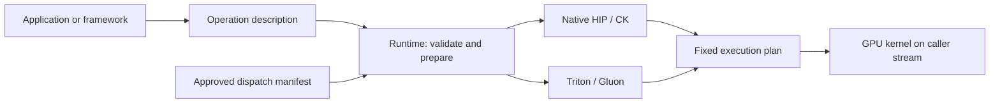

<div align="center">

</div>

# AI Tensor Engine for ROCm

AITER supplies optimized GPU operations for applications built on ROCm. Frameworks such as PyTorch, vLLM and SGLang use its kernels for matrix multiplication, attention, normalization, quantization, expert routing and communication.

This branch reorganizes the library around operation families and explicit preparation. It also adds installed-framework testing, repeatable builds and a searchable documentation site. [The rollout record](rollout.md) explains what is implemented, what has been tested and what is still required for a supported release.

## Start here

| What you want to do | Where to go |
| --- | --- |
| Read the guides as a searchable website | [Documentation website](https://AndreasKaratzas.github.io/aiter/) · [Local preview](docs/README.md) |
| Understand the structure and dependencies | [Architecture and diagrams](ARCHITECTURE.md) |
| Check dependency direction and repository layout | [Executable architecture rules](ci/architecture/README.md) |
| Run a prepared operation or connect several operations | [Runtime guide](aiter/runtime/README.md) |
| Try runnable Python, C++ and Rust programs | [Examples](examples/README.md) |
| Use native C/C++ or Rust | [Native SDK](include/aiter/README.md) and [Rust frontend](bindings/rust/README.md) |
| Find generators and build resources | [Code generation](aiter/codegen/README.md) |
| Inspect precompiled kernel bytes and their availability | [Kernel resources](aiter/kernels/data/README.md) |
| Run vLLM operators, models and serving cases | [vLLM test areas](tests/frameworks/vllm/README.md) |
| Measure operators or real vLLM models | [Benchmarks](benchmarks/README.md) |
| Measure implementations and pin a selection | [Tuning guide](aiter/tuning/README.md) |
| Build an editable installation or a wheel | [Build guide](build_backend/README.md) |
| Select tests, run a client profile or inspect release evidence | [CI guide](ci/README.md) |
| Consume the tested wheel in a container | [Container guide](docker/README.md) |
| Review changes, QA findings and the next PR boundaries | [Engineering notes](notes.md) and [rollout](rollout.md) |

The website renders these same guides. Its build checks links; Chromium checks desktop and mobile layouts, search, navigation and diagrams. Building the documentation does not need AITER or a GPU.

## Install for development

Use an environment with the appropriate ROCm Torch and Triton packages already selected for your GPU and application. The build system leaves those choices to the environment.

```bash
git clone --recursive --branch akaratza_aiter_implementation https://github.com/AndreasKaratzas/aiter.git
cd aiter
python -m pip install -e .
python -m aiter doctor --gpu
```

For an existing clone, initialize its pinned dependencies with `git submodule update --init --recursive`. Use `python -m aiter doctor` without `--gpu` to inspect package metadata without initializing a device.

Native source compilation needs the ROCm compiler; Triton and Gluon preparation need their compiler environment. [The dependency guide](requirements/README.md) explains runtime, build, test, documentation and client environments. [The build guide](build_backend/README.md) covers wheels and precompiled native providers.

## Prepare once, run repeatedly

```python
import torch
from aiter.runtime import Runtime

x = torch.randn(256, 4096, device="cuda:0", dtype=torch.bfloat16)
weight = torch.ones(4096, device=x.device, dtype=x.dtype)
out = torch.empty_like(x)

runtime = Runtime(device=0)
plan = runtime.prepare_rmsnorm(x, weight, out, backend="hip")
plan.execute({"x": x, "weight": weight, "out": out})
print(plan.explain())
```

Preparation checks the operation and loads or compiles its implementation. Execution reuses that implementation on the caller's stream. Your application owns the tensors and completion waits; `explain()` identifies the selected code.



The prepared interface covers RMSNorm, grouped FP8 quantization, ordinary FP8 blockscale GEMM, rotary embedding, dense attention, MXFP4 quantization and ordinary MXFP4 GEMM. Each provider declares its accepted shapes, layouts, dtypes and targets. Local GPU validation uses gfx950; it does not qualify gfx942.

Specialized FP4 layouts, paged attention, MLA, MoE and collectives retain their existing interfaces and lifecycle rules. Run `python -m aiter operators` to find a domain and see whether it has a prepared interface. The [architecture guide](ARCHITECTURE.md) explains the ports-and-adapters design and its current boundaries.

## Run the checks for your change

The host suite needs Git and a Linux C++17 compiler available as `c++`. It does not need Torch or a GPU. Install its Python test dependencies before running the CI commands:

```bash
python -m pip install -r requirements/test/host.txt
python -m ci list
python -m ci validate
python -m ci architecture check
python -m ci plan --profile host --architecture gfx950 --output /tmp/aiter-plan.json
python -m ci run --plan /tmp/aiter-plan.json --output-dir /tmp/aiter-run
python -m ci check --plan /tmp/aiter-plan.json --results /tmp/aiter-run
```

Here `gfx950` labels the candidate target; the `host` profile executes on the CPU. Numerical profiles such as `product-fast` additionally require the declared ROCm, Torch and GPU environment described in [the CI guide](ci/README.md).

The catalog groups host checks, GPU operations, SDK checks and client cases. The same commands run locally and in GitHub Actions. Plans identify the source and selected cases; changing the source requires a new plan. Client declarations live under `ci/clients/CLIENT/`.

Tests declare hardware requirements through [shared markers and fixtures](tests/common/README.md). Required qualification fails when a selected case cannot run. The vLLM nightly pipeline installs the framework in a fresh environment, installs the candidate AITER wheel, checks imports and runs its declared operator and model groups. Model tests require observed AITER execution as well as correct results.

[The CI guide](ci/README.md) explains the daily, extended and release profiles. Framework correctness and performance measurements have separate acceptance conditions; a passing source test does not qualify an untested wheel or container image.

## Repository map

```text
aiter/
  api/             Operation meanings and tensor descriptions
  runtime/         Preparation, execution policy and plans
  backends/        Native and DSL provider adapters
  tuning/          Immutable selections and offline search programs
  codegen/         Named generators and declared build resources
  kernels/         Resource catalog, admission logic and data/ code objects
  testing/         Shared tensor, numerical and measurement helpers
  ops/, jit/, aot/ Kernels, launch bridges and compilation
include/aiter/     Public native C header
bindings/rust/    Typed Rust client of the same native SDK
csrc/             Native kernel sources; blas/ owns tuning bridges
build_backend/    Immutable build plans, phase controller and package adapters
ci/               Architecture checks, qualification, pipelines and delivery
  workflows/      Python workflow generator and validator
.github/workflow-sources/ Editable repository/, library/, frameworks/, release/ YAML
  reusable/       Complete shared jobs; schedules/ holds cron-only callers
.github/workflows/ Generated GitHub entrypoints; edit their linked source instead
.github/actions/  Small reusable job steps
.github/scripts/  common/, repository/, library/, frameworks/, release/ adapters
tests/            unit/, integration/, frameworks/{common,pytorch,vllm,sglang}
  common/         Hardware markers, model fixtures and process/origin helpers
benchmarks/       operators/, vllm/, model-shape sweeps and traces/
examples/         Runnable Python and native integration examples
requirements/     runtime/, build/, test/, docs/, clients/ dependency inputs
docker/           common/, pytorch/, vllm/, sglang/ image recipes
docs/             Website, canonical-guide mapping and browser checks
```

`aiter/` is the installed library. `ci/` is repository automation and does not ship in the SDK. Kernel bytes belong to the library under `aiter/kernels/data/`; logs, reports and writable compilation caches belong outside the checkout.

For a vLLM workflow, start in [`.github/workflow-sources/frameworks/vllm/`](.github/workflow-sources/frameworks/vllm/README.md). GitHub requires its executable workflow files in a flat directory, so `python -m ci.workflows --write` copies the organized sources into `.github/workflows/`. CI rejects a stale copy. The [workflow guide](.github/workflow-sources/README.md) explains how to add or change a job.

For implementation details, see [Opus](csrc/include/opus/README.md), [Triton development](aiter/ops/triton/README.md), [native attention benchmarks](benchmarks/native/mha/README.md) and [Triton communication](docs/triton_comms.md).
