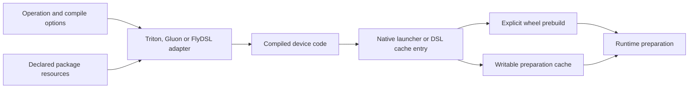

# Preparing compiled kernels

This package compiles kernels before they are needed by an application. It serves two callers: a wheel build that prepares a selected collection of kernels, and a runtime preparation step that needs a native launcher for one operation. An already prepared execution plan retains its launcher and does not come back here during execution.

| Location | What to look for |
| --- | --- |
| `triton/compiler.py`, `gluon/compiler.py` | Compiler adapters that return generated launcher files and the kernel symbol |
| `source.py` | Exact kernel-module loading and launcher generation from declared native templates |
| `compiler.py` | Native library construction and loading used by the compatibility launch bridges |
| `runner.py` | Bounded parallel compilation that propagates worker failures |
| `pa.py`, `pa_v1.py`, `pa_ragged.py`, `sampling.py`, `triton/norm.py` | Operation-specific prebuild jobs |
| `flydsl/` | FlyDSL job collection, precompilation and installed-cache handling |

The operation-specific modules describe what to compile. Compiler adapters describe how to turn that request into callable code. Native source generation that produces HIP or CK source files belongs in [`aiter.codegen`](../codegen/README.md), and Python bridges that call the resulting libraries belong in `aiter.ops._native`.

Build inputs come from `BuildContext` and the package's versioned resource layout. Kernel modules load by their exact requested origin; their directories are never added to the process import path. Generated launchers use the device argument widths, so an FP32 scalar is passed as a C `float` even though Python initially represents it as a double.

Native preparation writes to `AITER_AOT_CACHE_DIR`, or the JIT cache's `aot/` directory by default. An explicit output path keeps a standalone compiler invocation's files together. Wheel prebuilds run in an owned staging tree. Ordinary wheel construction does not copy incidental JIT or DSL caches from a developer's checkout.

Start with [the build guide](../../build_backend/README.md) for wheel options or [the FlyDSL guide](flydsl/README.md) for that compiler's jobs and cache behavior. The executable examples and their native consumers live under `tests/integration/packaging/`; they verify real generated symbols and numerical results from both source and installed packages.
