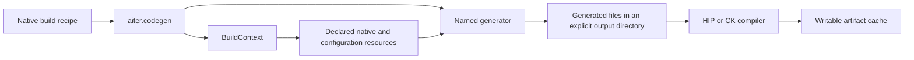

# Native source generation

`aiter.codegen` turns kernel descriptions and tuning inputs into native build files. It runs when preparing an artifact; executing an already prepared operation does not enter this package.



Use the same commands in a checkout or an installed wheel:

```sh
python -m aiter.codegen --list
python -m aiter.codegen gemm.ck_a8w8_blockscale --help
GPU_ARCHS=gfx950 python -m aiter.codegen gemm.ck_a8w8_blockscale \
    --output /tmp/aiter-generated/ck
GPU_ARCHS=gfx950 python -m aiter.codegen gemm.ck_tile_a8w8_blockscale \
    --output /tmp/aiter-generated/ck-tile
```

Each generator requires an explicit output directory. The existing family options, including `--tune` and `--tune_file`, remain available. A missing optional tuned CSV uses the family's default kernel table where that behavior was already supported. It does not create an approved runtime selection.

| Location | Responsibility |
| --- | --- |
| `registry.json` | Stable command names and their implementing modules. |
| `context.py` | The selected package's native sources, managed kernels, configuration and vendor resources. |
| `gemm/`, `moe/` | Instance descriptions and family-specific source generation. |
| `attention/`, `elementwise/`, `assembly/` | Attention support code, elementwise instances and assembly lookup headers. |
| `vendor/` | Adapters that invoke generators from the pinned CK dependency. |
| `../aot/` | Compiler adapters that produce native launchers and embedded code objects. |
| `../ops/_native/` | Python bindings that use native templates and compiled launchers. |

`aiter/_build_layout.json` declares resource paths relative to the package. Wheel staging writes an installed layout pointing to its delivered native payload. The loader reads that one versioned record; it does not search parent directories or add native source folders to Python's import path. A caller may supply explicit resource overrides through `BuildContext`; child processes receive the same complete context and selected package location.

JIT recipes invoke the package entrypoint with the current Python interpreter and checked subprocess status. A generator failure stops its build. Writable JIT artifacts use `AITER_JIT_DIR`, or `$XDG_CACHE_HOME/aiter/jit` (normally `~/.cache/aiter/jit`). Installed AOT extensions remain read-only load candidates. The separate native-launcher cache uses `AITER_AOT_CACHE_DIR`, or `aot/` inside the JIT cache; an existing explicit `AITER_ROOT_DIR` remains supported.

To add a generator, place its descriptions and implementation in its operation family, implement `main(argv, *, context)`, register its command, and use that command in the native build recipe. Resolve native assets through the supplied context. Tests cover cold entrypoints, source/wheel resource records, real CK and CKTile generation, and the absence of Python execution files in `csrc`.

The BF16 assembly manifest declares `supports_fp32` for every kernel. Both the native dispatcher and the offline tuning search consume that capability; a kernel's symbol name does not determine its output format. Generation rejects missing or invalid capability values. These manifests describe fixed kernel properties and remain separate from measured tuning choices or approved runtime dispatch manifests.

The schema 2 layout names the original `kernels` resource independently of any admitted runtime snapshot. Assembly lookup generation consumes verified catalog rows, including explicit variant alternatives; declared unavailable selections are reported and omitted from emitted dispatch data. See the [kernel manager](../kernels/README.md) for validation and cache admission.

## Compile CK layernorm without reparsing every fragment separately

The pinned CK generator produces one API file and 392 small instantiation files. Each fragment includes the same template header. The AITER adapter can group those fragments into deterministic compiler batches while retaining their exact bytes under `layernorm2d_fwd_instances/`. It validates that each fragment contains only its expected include and unique explicit instantiations before writing any replacement output.

```bash
python -m aiter.codegen ck.layernorm --api fwd --gen_blobs --batch-size 8 --working_path /tmp/aiter-layernorm-batched
python -m aiter.codegen ck.layernorm --api fwd --gen_blobs --batch-size 1 --working_path /tmp/aiter-layernorm-individual
```

The ordinary native recipe selects eight fragments per batch. `--batch-size 1` retains the original individual compilation units and is the debugging baseline; supported sizes range from 1 through 32. `layernorm2d_fwd_compilation.json` records the policy, source digests, batch membership and complete 1,440-instantiation identity for the current pinned dependency. `--list_blobs` includes the shared header, API, compilation ledger, compile units and every included fragment, so copying the listed closure retains all build inputs. Switching policies in the same output directory removes the generator's stale units without deleting other generators' files.

Batching changes host compilation organization, not the native dispatch table or kernel sources. The current CK generator supports its declared smooth-quant paths with FP32 scales and widths through 8192. Its old private dynamic-only quantization adapters have no corresponding generated specialization and now reject explicitly; the separate public Triton functions retain their existing interfaces.
