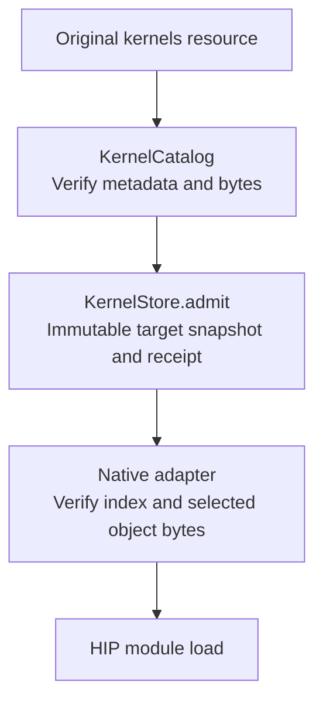

# Kernel resource manager

The resource manager separates three responsibilities: describe delivered bytes, admit verified inputs to a cache, and load a selected native object. It does not select a GEMM algorithm or tune a workload.



`KernelCatalog` and `tables.py` use only the standard library. Loading a catalog parses its manifest without probing GPUs or copying its binaries. `verify()` checks exact inventory, checksums, ELF target fields, selection schemas and object references. `rows()` returns validated available selections. `verify()` also reports declared unavailable rows; `require_complete=True` rejects them.

```python
from aiter.codegen.context import BuildContext
from aiter.kernels import KernelCatalog, KernelStore, verify_admission

context = BuildContext.load()
catalog = KernelCatalog.load(context.resource("kernels"))
report = catalog.verify(targets=("gfx950",), require_complete=True)
admission = KernelStore("/tmp/aiter-kernel-cache").admit(
    catalog, targets=("gfx950",), require_complete=True
)
verify_admission(admission)
```

`KernelStore` copies verified bytes into a new directory and atomically renames it into place. Files and directories become read-only. A concurrent admission uses the same validated snapshot; a corrupted existing snapshot causes an error. The store never repairs changed data silently. `verify_admission()` checks both the original selected inputs and the complete admitted snapshot by default.

The receipt contains `schema_version`, `source_root`, `root`, `manifest_sha256`, `index_sha256` and `targets`. `source_root` always identifies the original catalog; `root` always identifies the admitted cache. Its `environment()` method supplies `AITER_ASM_DIR`, `AITER_KERNEL_INDEX_SHA256` and `AITER_KERNEL_ADMISSION` for an explicitly launched native child.

The manager owns `data/`, containing the same managed assets in a checkout and a wheel. `BuildContext` schema 2 records `kernels` beside `native`, `configs` and vendor resources. Its `assembly` accessor remains a compatibility alias for the original resource. The exported Python `AITER_ASM_DIR` constant likewise names the original resource; the process environment is the historical native execution bridge. Child build contexts preserve original roots even after native admission.

Native recipes declare `requires: ["kernels"]` and explicit `kernel_targets`. The JIT preparation adapter in `aiter.jit.resources` observes the active target, admits the catalog and sets the execution environment before loading those modules on their declared targets. Other modules do not enter the resource manager. Each new adapter preparation revalidates its admission; normal operator calls reuse the loaded adapter. Cached assembly extensions must expose the resource-loader ABI probe; older extensions are rebuilt before reuse. The native loader checks the exact index digest and selected object's checksum before HIP sees the object. Objects already loaded into a HIP module keep their validated resident bytes.

The environment is controlled by the calling process. The integrity checks do not authenticate the publisher of an arbitrary replacement manifest, and the catalog does not certify an operator's argument ABI or GPU results. Shipped provenance limits and known unavailable selections are listed in the [resource guide](data/README.md).
