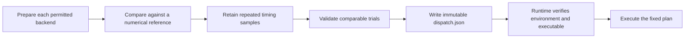

# Measure, select, then execute

Tuning answers a specific question: which correct implementation is fastest for these exact tensor descriptions on this GPU and software environment? A measurement is evidence. A dispatch manifest is a decision based on that evidence. A prepared execution plan retains that decision while requests run.



Run a complete example from the repository root in a ROCm environment:

```bash
python examples/tune_rmsnorm.py --output /tmp/rmsnorm-selection
python -m aiter manifest /tmp/rmsnorm-selection/dispatch.json
```

The example compares native HIP and Triton RMSNorm against an FP32 reference, captures 100 executions, takes seven GPU-event measurements after warmup, and retains the samples and numerical tolerances. It promotes the median winner and then executes a fresh runtime using that manifest. The directory must be new so another run cannot replace its evidence. These are local kernel measurements; they do not measure model throughput or establish release qualification.

`Trial` identifies the request, target, backend, executable bytes, environment, timing protocol and retained evidence. `promote()` rejects empty input, failed correctness checks, duplicate implementation trials and incomparable environments or protocols. Each implementation needs at least three positive timing samples. Equal medians use a deterministic ordering. The caller is responsible for retaining and reviewing the evidence; a digest does not authenticate the person who produced it.

`DispatchManifest` contains only exact-workload selections. A different shape, dtype, layout, target, environment or executable requires a new selection. `Runtime(manifest=...)` verifies these conditions during preparation. Updating a file cannot change a plan already executing. Rollback means preparing with a previously validated manifest and its matching environment and artifact.

`import_legacy_csv(path)` preserves the original rows and source hash, marking them as unverified measurements. It does not invent missing numerical checks or build identities. Existing operators still use their original CSV dispatch paths until each operation moves to prepared execution. The new prepared path never consults a CSV during launch.

When an existing operator combines several configuration tables, `tables.merge_tables` reads them without modifying the inputs. Shape columns must match the family's schema; only documented legacy fields have defaults. Overlapping shapes fail with both source locations, even if one row reports a shorter time. Resolve that choice offline, where the measurements can be compared properly. A successful merge is written under the writable JIT cache using a hash of its content, so two processes with different inputs cannot overwrite each other's selection file. A family without a shape schema uses complete-row duplicate checks and receives no new qualification guarantee.

Offline kernel searches live in [`search/`](search/README.md). The [`Triton profiler guide`](search/triton/README.md) explains how to retain configurations, traces and timing samples without silently changing runtime policy.

The dedicated BLAS search is `python -m aiter.tuning gemm.hipblaslt`. It uses the same native `csrc/blas` bridges and tuner infrastructure as other searches; there is no separate gradlib distribution to install. Input/output CSV options remain available. Generated default shape inputs use a private temporary file, and failures propagate to the invoking pipeline without automatic crash retries. The multi-provider BF16 search remains `gemm.a16w16`.