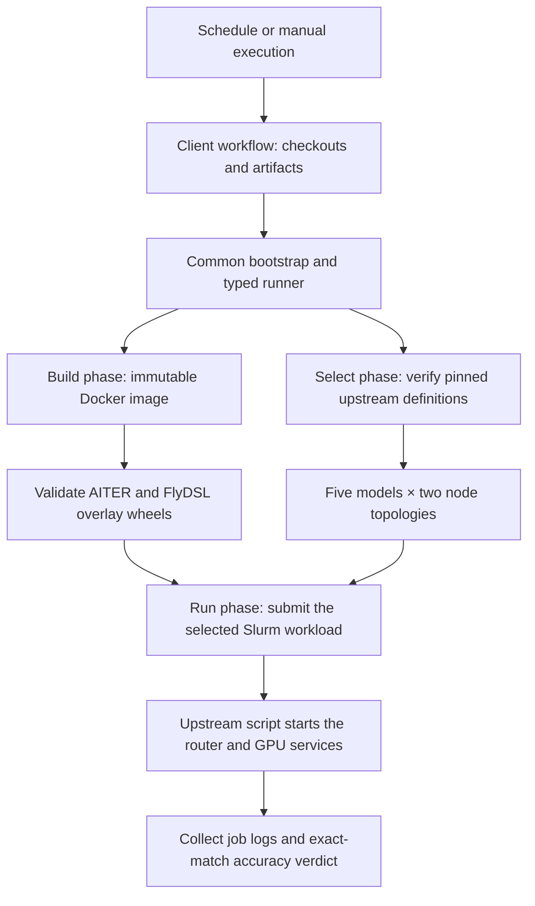

# vLLM disaggregated serving

Disaggregated serving runs prompt processing and token generation on different GPU nodes. This pipeline checks that a candidate AITER wheel works in that arrangement, using vLLM's existing Slurm workload and its model-accuracy gate. It needs a shared filesystem and the Spur cluster; the ordinary single-machine vLLM tests do not need either.

## Follow one case



The workflow selects a case ID. The runner derives its argument list and environment from reviewed definitions; the matrix cannot supply a shell command. Slurm remains responsible for allocating nodes and starting the upstream GPU containers. The build phase uses the shared Docker adapter, including immutable image resolution and container cleanup.

| File | Responsibility |
| --- | --- |
| [Workflow source](../../../workflows/clients/vllm/disaggregation.yaml) | Checkouts, job dependencies, artifact transfer |
| [selection.json](selection.json) | Pinned upstream revision, images, model families and topology definitions |
| [selection.py](selection.py) | Compare the declared cases with the exact upstream pipeline bytes |
| [__main__.py](__main__.py) | Admit inputs and execute the four phases |
| [build-wheel.sh](build-wheel.sh) | Build the targeted native wheel inside Docker |
| [artifacts.py](artifacts.py) | Verify archive paths, native module hashes and offline wheel contents |
| [cluster-env.sh](cluster-env.sh) | Load the wheel overlay on compute nodes |
| [cluster.py](cluster.py) | Admit the node pool, submit work and cancel owned jobs on failure |
| [logs.py](logs.py) | Follow the submitted job and check its final accuracy score |

## Workload selection

The selection preserves all ten active `vllm-router` cases from the [pinned upstream pipeline](https://github.com/vllm-project/vllm/blob/a42850c85f815ab3123a541bc92fb9b35892335e/.buildkite/amd-disagg/pipeline-disagg.yaml). Each family below runs both topologies. Separate upstream proxy cases and commented-out wide-expert-parallel experiments are not part of this selection.

| Model family | Two nodes | Four nodes |
| --- | --- | --- |
| DeepSeek-V3 | One prefill, one decode | Two prefill, two decode |
| DeepSeek-R1-MXFP4 | One prefill, one decode | Two prefill, two decode |
| Kimi-K2.5-MXFP4 | One prefill, one decode | Two prefill, two decode |
| Kimi-K2.6-MXFP4 | One prefill, one decode | Two prefill, two decode |
| MiniMax-M3-MXFP8 | One prefill, one decode | Two prefill, two decode |

Each service uses eight GPUs and the upstream MoRI transfer setup. The current wheel build targets `gfx950`, with AITER enabled in the compute environment. These are declared cluster cases, not evidence that they have all executed successfully on the local development machine.

## Change or diagnose the pipeline

To change a model or topology, first choose the upstream revision and update `selection.json` together with the two checkout pins in the workflow. Refresh the pinned test fixture and prove that the selector still derives exactly the intended active cases. The selector checks the pipeline hash and its supported command format; an upstream change requires review rather than silently changing the nightly workload.

The four values of `PIPELINE_PHASE` are `build`, `select`, `run` and `collect`. They all enter through the same interface, from the reviewed controls checkout:

```bash
PIPELINE_OPERATION=vllm-disaggregation PIPELINE_PHASE=select \
  python3 -m ci.pipelines.bootstrap \
  --source /path/to/pinned-vllm \
  --controls /path/to/reviewed-aiter \
  --output /path/to/new-selection-evidence
```

Selection does not require a GPU. Build requires Docker and the candidate AITER source; run requires Slurm, downloaded overlay wheels, the shared log path and the configured node pool. Evidence must use a new directory outside both checkouts. The workflow supplies the remaining job-specific inputs.

The overlay admits exactly one AITER wheel and one FlyDSL wheel. It verifies the two requested native modules against the embedded build receipt before extracting anything. Duplicate paths, file/directory conflicts and unsafe archive members fail admission. Compute nodes import those admitted bytes from the shared overlay without installing packages there.

A successful submission alone is insufficient. Collection requires exactly one submitted job, its own result log, a finite score and threshold, and a consistent `PASS` verdict. Failure retains submission records and cancels only jobs found in that submission's output. Optional Slurm accounting errors are retained separately and cannot replace the workload's outcome. An independent always-run collection step keeps available evidence even when execution fails.

Host tests exercise the pinned ten-case selection, wheel admission, real subprocess submission with fake Slurm executables, cancellation, diagnostic failure and accuracy parsing. Cluster execution remains a separate acceptance step; these host tests do not establish Docker, network or multi-node model performance.
