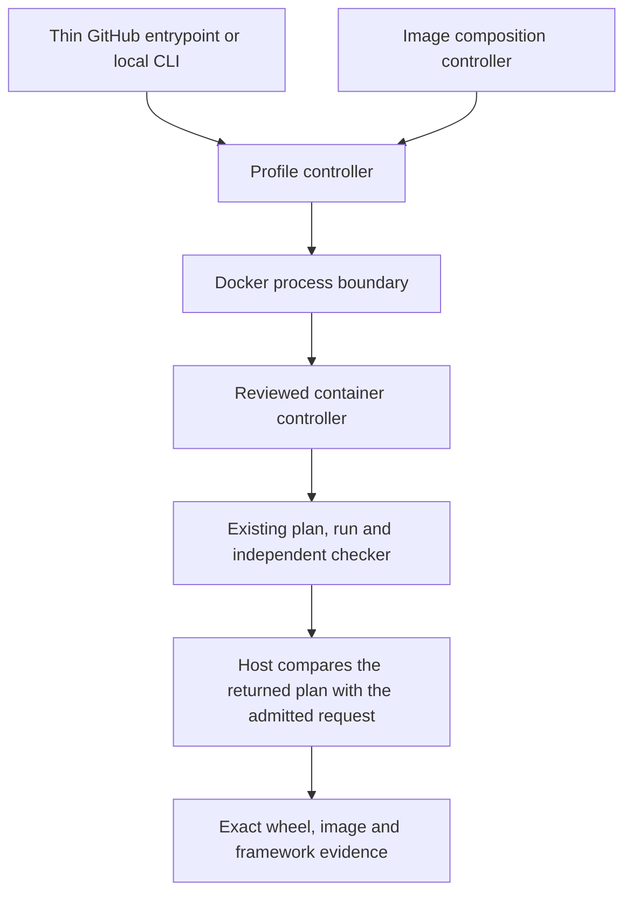

# One execution path from a change to tested images

The pipeline application connects the existing qualification and release libraries. It owns the sequence of operations; the test catalog still decides what must run, and the independent checker still decides whether retained evidence passes.

| Module | Responsibility |
|---|---|
| `profile.py` | Admit candidate/control inputs, resolve an executor, run qualification and reconstruct its exact expected result |
| `request.py` | Validate the execution request and derive the precise plan the host expects back |
| `container.py` | Install the selected wheel when needed, then perform plan → run → check inside the executor |
| `process.py`, `docker.py` | One bounded process lifecycle for installer and Docker clients; Docker adds immutable inspection, mounts and daemon-container cleanup |
| `nightly.py` | Resolve/install a fresh official vLLM nightly, install candidate AITER afterward, gate imports, then call the shared qualified runner |
| `images.py` | Compose product and framework images, call the same profile executor, export and verify image records |
| `canaries.py` | Execute the registered vLLM latency and SGLang model cases through the same retained Docker process boundary |
| `workflows.py` | Check the complete workflow inventory and render its domain navigation |



Source, wheel and preinstalled-image execution share this path. Every request names separate candidate and control identities, the environment, GPU allocation and exact artifact. The host rejects a container that returns a passing plan for a different profile, image or artifact. Read-only mounts keep candidate code from replacing reviewed controls. Qualification still creates fresh caches for each group and validates imported package and native-resource origins.

For a local Docker executor, finish source edits first and supply a reviewed environment lock:

```bash
python -m ci.pipelines profile \
  --source /work/candidate --controls /work/reviewed-controls \
  --output /tmp/new-attempt --mode source --profile product-fast \
  --architecture gfx950 --gpus 0,1 \
  --image 'approved/executor@sha256:THE_DIGEST' --lock-file /work/environment.json
```

Use `--mode wheel --wheel-dir /work/artifacts --wheel-name CANDIDATE.whl` for an installed-wheel run. The receipt must match the candidate checkout and be clean. `profile` needs a new output directory; failed attempts remain available instead of being overwritten.

`images` takes the same source/control inputs, `--wheel`, `--role`, an approved product lock and `--consumers-file` describing the required framework locks. The release matrix produces those consumer records from `docker/images.json`. The controller builds from reviewed recipes, runs the product and every required framework profile, saves the tested image and emits the verified record. Registry credentials and publication remain outside this application.

Image qualification currently targets gfx950 on physical devices 0 and 1. This is the declared scope of the installed image and framework bridge profiles; it does not establish image support for another GPU architecture. The container bootstrap installs the pinned test tools `pytest==9.0.2` and `tabulate==0.10.0` before executing the admitted plan.

[Workflow navigation](../../.github/workflows/README.md) lists every entrypoint. Qualified product and release execution use these controllers. Specialized ATOM, FlashAttention, disaggregated serving, network and kernel bring-up jobs keep their explicit platform procedures; their inventory entries identify them separately. Their results do not automatically become approved release coverage. This application does not hide those remaining procedures behind a claim that every workflow has been migrated.

The `canary` command also centralizes execution of the registered vLLM latency and SGLang model cases. Their manifests contain argument arrays and environment values, rather than shell fragments. These jobs retain the actual image identity, selected model command, output and timing. They remain rolling upstream canaries: vLLM uses dummy weights for latency, and SGLang retains its upstream container setup. Neither result is substituted for a supported environment lock or a release qualification record.

`vllm-nightly` is the fresh-consumer path. It records each rolling artifact instead of treating an existing image package as an installation test. Its `imports` and `workloads` stages use separate complete sealed plans; failure in the first prevents the second. Source, wheel and control identities remain independent. See the [nightly installation guide](../clients/vllm/README.md) for worker requirements and the deliberately advisory classification.

For a diagnostic installation/import attempt, `vllm-nightly --through imports` stops after the complete import profile and dependency recheck. Its report records `scope: imports`; scheduled qualification always runs the selected full workload profile. `--workload-profile vllm-nightly` selects the daily 19 groups; `--workload-profile vllm-extended` selects all 23 groups, including the daily definitions. This choice is sealed in the request and checked again inside the executor.

The observer records the actual Python executable and mapped Linux loader/libc hashes. A separately provisioned userspace can satisfy a wheel's real glibc tag without modifying the host, but its local evidence remains distinct from an OCI executor identity. No platform-tag override is accepted or required.

`vllm-benchmark` reuses `vllm-nightly` through its complete installation/import stage, then invokes the [real-weight benchmark application](../../benchmarks/vllm/README.md) in that exact private environment. The candidate wheel is installed last; post-measurement checks verify every installed payload and the model declaration again. The benchmark retains raw batch samples and reconstructs throughput from actual generated token counts. The older dummy-weight latency application remains explicitly separate.

The [workflow script inventory](../../.github/scripts/README.md) identifies each retained shell or Python adapter by owner and direct callers. `python -m ci.pipelines scripts --check` rejects missing or unowned helpers and stale workflow references; `--write-index` refreshes its navigation page. GitHub entrypoints remain flat, while these adapters live under common, product, host, client and release owners.
