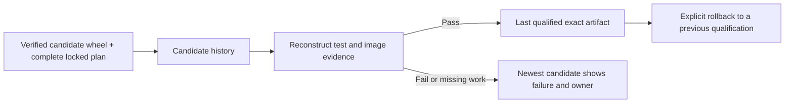

# Following a candidate from build to adoption

A failed nightly should be visible even while consumers continue using yesterday's working version. `ci.release.channels` keeps those two facts separate: the newest candidate is the most recent attempt, and the last qualified artifact is the exact version that passed a profile's complete checks. A profile includes the client, GPU architecture and approved environment lock. Passing a test in a different environment does not move its pointer.

The commands below write local JSON records. They do not publish packages, move registry tags or change a consumer checkout. The publishing workflow can retain these records alongside the wheel, image and execution evidence. Keep the store and observations outside the source checkout so recording delivery results does not change the source identity being tested.

## A nightly that fails remains visible



Register a candidate after its wheel receipt and complete test plan exist:

```sh
python -m ci channels candidate \
  --store /tmp/aiter-channels \
  --release /tmp/candidate-release.json \
  --plan /tmp/qualification-plan.json \
  --wheel-dir /tmp/wheels \
  --owner @AndreasKaratzas \
  --delta 'Fix grouped FP8 scaling; framework pins are unchanged.' \
  --output /tmp/candidate-record.json
```

The response includes a candidate digest and the new state digest. Subsequent writes require that state digest through `--expected-digest`. This is a check against another job having changed the channel since it was read. The store also uses a process lock and an atomic file replacement, so competing writers cannot partially replace history.

Record the result with `python -m ci channels result`, supplying `--store`, `--candidate`, `--run` and `--expected-digest`. This command rereads the test logs and attempt history through the same checker used by release qualification. A failed or unfinished run is recorded as such. It does not advance the qualified reference, and a second result cannot erase the first failure. Rework becomes a new candidate with its own complete evidence.

When images belong to the qualified profile, also supply `--images` with a JSON list of evidence objects. Each object contains `record`, `archive` and `runs`, whose values are local paths. The check verifies the image archive bytes and reconstructs every declared execution. A runtime image and its inherited framework image may have different approved environment locks; at least the check corresponding to this channel's client and environment must match. An empty image list means this record qualifies wheel consumption only, and makes no image claim.

```sh
python -m ci channels index \
  --store /tmp/aiter-channels \
  --output /tmp/nightly-index.json
```

For each profile, the index contains the newest candidate's identity, source, wheel, required plan, environment, owner, delta and failure details. Beside it are the last qualified wheel and images, the qualification and report digests, and its age. A slow older job cannot overwrite a newer candidate's decision.

## Roll back to the bytes that actually passed

`python -m ci channels rollback` requires `--qualification`, `--owner`, `--reason`, `--store` and `--expected-digest`. The target must be a previously passing qualification in this history. The resulting pointer restores that qualification's wheel and image digests. It never rebuilds a wheel, changes a version or silently replaces image contents.

Rollback leaves the newer candidate and its evidence visible. It also creates a decision barrier: a candidate registered before that rollback cannot undo it merely by finishing later. Register and qualify a new candidate to advance again, or make another explicit rollback decision. Moving a remote registry reference remains a separate publishing operation and must preserve this exact identity.

## Measure the waits, without guessing them

`ci.release.metrics` retains the input evidence used for a measurement and checks it again when producing a summary. Queue, build, test and rework are separate phases. An execution record identifies its source revision, profile, run/job and planned artifacts, along with UTC start/end times and its measured duration. Those identities cannot be replaced when importing it as a measurement.

```sh
python -m ci metrics interval \
  --output-dir /tmp/aiter-observations \
  --execution /tmp/qualification-run/group/attempt-0001/tests.execution.json \
  --phase test \
  --source-revision SOURCE_SHA \
  --profile product-nightly \
  --run-id EXECUTOR_RUN_ID

python -m ci metrics summarize \
  --observations /tmp/aiter-observations \
  --channels /tmp/aiter-channels \
  --output /tmp/delivery-metrics.json
```

Use the source and run identifiers in the execution record. Include `--artifact` with an artifact JSON object when measuring one planned wheel. The runner writes actual command timings. For a historical complete run, `summarize --run RUN_DIRECTORY` can also reconstruct its passing or failing report and sum the recorded attempt durations.

Two ten-second tests running together consume twenty worker-seconds but roughly ten seconds of elapsed time. The summary reports both measures. It does not add queue, build and test worker time and call the result delivery lead time. Missing observations appear as `null`, not zero. A retry alone is not a measurement of engineering rework.

Queue and rework observations come from the controller that observes those intervals. They identify `source_revision`, `profile`, `run_id` and `phase`. Queue supplies `queued_utc` and `started_utc`; rework supplies `started_utc` and `finished_utc`. The `change` command accepts a controller event containing `source_revision`, `profile`, `run_id`, `changed_utc` and its `reference`. Together with a channel qualification, it produces change-to-qualified timing for the specific artifact and environment, rather than implying the entire support matrix finished at once.

## Adoption means a merged pin and a working consumer image

The `adoption` command verifies both halves. Its merge event identifies `consumer`, `merged_commit`, `merged_utc`, controller `reference` and `run_id`. Local Git must show that commit on the supplied accepted branch and that the committed AITER lock JSON contains the exact qualified `artifact` object. The image evidence must then pass the consumer's complete checks and show that same clean framework revision. Acceptance time is the later of the observed merge and the image test completion.

The consumer artifact lock is ordinary JSON with an `artifact` object containing `filename`, `sha256` and `size_bytes`. It belongs with the dependency update in the consumer repository. A locally created branch or a passing AITER operator test alone does not count as adoption.

The `reuse` command measures eligible consumer builds separately from new environment work. Its controller event contains `consumer`, `run_id`, `observed_utc`, `environment_lock_digest`, the consumed `artifact` or null, `eligible`, `reason` and `reference`. If an artifact is supplied, `--wheel` must provide those exact bytes. Eligible builds with a different wheel remain in the denominator; builds for a new environment are reported separately. No observations means no reuse percentage.

These content hashes detect changed or inconsistent records. They do not authenticate an external merge event, prove that a local branch was accepted on GitHub, or establish a service-level promise. Run the collectors in the reviewed controller, retain its job provenance and publish only through the release gate. This implementation can establish an observed baseline; it does not claim that delivery or adoption has already become faster.

## What the workflows record automatically

The nightly and stable workflows call `ci.release.channel_delivery` after their build, qualification, image and publication stages finish. The controller reads the retained qualification matrix, wheel receipts, execution plans, test logs and image archives. A successful job summary cannot substitute for missing evidence. Each required image role—runtime, development and wheelhouse—must have its own verified archive and complete checks.

If a build fails before a wheel or matrix exists, the history records that failure without inventing a wheel identity. If one qualification fails, its newest candidate stays visible with the failed stage and investigating owner; the previous qualified reference remains available. Repeating the same finalization is idempotent. A retry with changed evidence must use a new workflow attempt.

Channel scope remains specific to its profile, architecture and environment. A gfx942 wheel check does not inherit a gfx950 image claim. SGLang currently qualifies wheel consumption; only the explicitly tested vLLM profile adds a framework image claim. The controller preflights all generic release image roles before advancing any profile.

The finalizer also imports the runner's actual test invocation records and the completed wheel-builder jobs from the GitHub API endpoint for that exact workflow attempt. Builder duration covers the entire job, including setup, packaging and artifact upload; it is not compiler-only time. The workflow control commit and released source commit are retained separately because a stable tag can name a different source revision. Missing or inconsistent timing evidence appears in `finalization.json`; it never becomes a zero-duration measurement. Run creation time is not treated as GPU queue time.

The workflow retains `state.json`, `index.json`, `metrics.json`, input observations and finalization failures as artifacts. Configured publication uses an S3 compare-and-swap token for the authoritative state, with immutable digest-addressed views. A competing update fails rather than overwriting another decision. The same workflow exposes an explicit rollback operation targeting a recorded qualification digest. No publication or remote state update is performed by local finalization.
