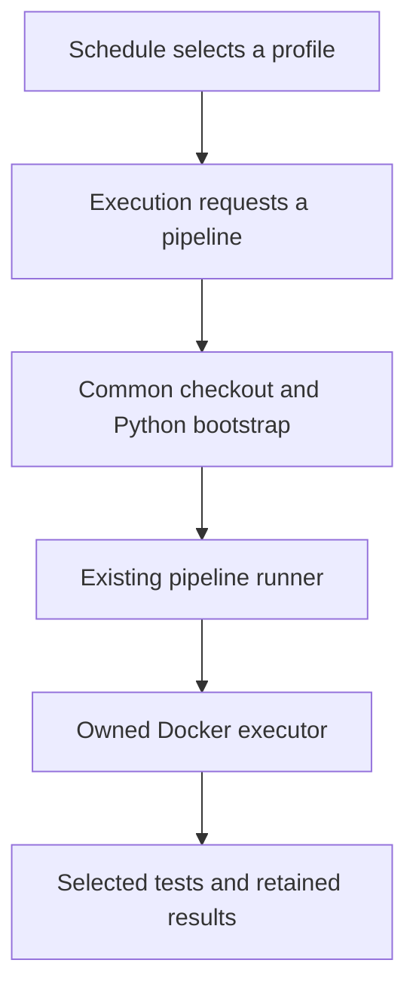

# Find when, what and how CI runs

Start with the question you want to answer. A schedule chooses an execution workflow. That workflow chooses a reviewed profile. The profile names test groups, and each group names actual test paths and prerequisites. These are separate files because changing a time should not require understanding installation or model execution.

| Question | Read or edit |
| --- | --- |
| When does it run? | `schedules/host/`, `schedules/product/`, `schedules/clients/` or `schedules/release/` |
| Which execution is requested? | `product/`, `clients/`, `host/` or `release/`; see the [source index](index.md) |
| Which tests and prerequisites? | Product [catalog](../qualification/catalog.json), client [registry](../clients/registry.json), and each client's groups/profiles |
| How are checkout, artifacts and execution connected? | [common/run-profile.yaml](common/run-profile.yaml) and [ci/pipelines](../pipelines/README.md) |
| How do I add a vLLM test or measurement? | [vLLM workflow guide](clients/vllm/README.md), then its linked test or benchmark application |

## Follow one run

The [daily vLLM schedule](schedules/clients/vllm/nightly-daily.yaml) supplies `vllm-nightly` to the [execution definition](clients/vllm/nightly.yaml). That definition builds the candidate wheel and calls the common workflow. The common workflow checks out reviewed instructions into `control/`, the AITER version under evaluation into `candidate/`, downloads its artifact and invokes one command: `python3 -S -m ci.pipelines.bootstrap`.



The bootstrap converts explicit job inputs into an argument array for the existing runner. It contains no test lists, shell command language or installer. The runner selects the qualification, rolling installation, platform or measurement controller. Qualified controllers continue to verify candidate/control identities, artifacts, environment locks, private caches and results; platform adapters retain their explicitly scoped upstream evidence. Docker owns bounded process and container cleanup. Failed installation or import admission prevents model workloads from running. `bootstrap.json` records the handoff beside the controller's existing evidence, so release consumers retain their established layout.

The generic `profile` operation serves product, PyTorch, SGLang, vLLM and any subsequently reviewed client profile. It does not require a new bootstrap implementation per client. Rolling vLLM installation and real-model measurements are explicit operations because their installation and measurement semantics differ from qualification in a locked environment. Specialized upstream model, multi-node and kernel bring-up workflows retain their declared platform procedures; moving their cron trigger does not claim those procedures have migrated to the qualified runner.

## Existing product and SGLang execution

| Execution | Area or case definition | Shared handoff and owned controller |
| --- | --- | --- |
| Product standard tests | [Product areas](../pipelines/product_areas.json), eight file lists from the existing weighted splitter | [Reusable product job](common/product-area.yaml) → bootstrap → [product controller](../pipelines/product.py) → Docker |
| Product communication tests | The same area file, with the historical communication inventory | The same reusable job and controller, with `multi-gpu` selected |
| SGLang upstream model tests | [Declared cases](../clients/sglang/canaries.json) and their event selection | [Model workflow](clients/sglang/models.yaml) → bootstrap → [SGLang controller](../clients/sglang/downstream.py) → upstream platform scripts and Docker |

The product matrix is two runner types crossed with shard indices 0–7. Admission requires every reviewed file exactly once across those eight lists; the selected list and file hashes are retained. Both product areas use one installation and driver path. Tests run from a copied control suite against the installed candidate wheel, so no wheel libraries are copied into a candidate source checkout. `standard`, `multi-gpu`, `standard-test-finish` and `aiter-test-gate` retain their existing workflow identities and artifact naming. Build, S3 publication and tuned-performance bookkeeping remain separate jobs in the product workflow.

SGLang's controller owns upstream checkout and patching, dependency setup, installation of the selected AITER source, its import gate, model execution and container cleanup. It resolves the upstream commit and image and retains those identities. It uses a unique container name and fresh native caches. Its upstream serving harness and large-model requirements remain those of the declared case; this rolling adapter does not issue supported-release evidence. The YAML retains event selection, runner allocation, credential admission and evidence upload.

## Inspect test areas without reading orchestration

Run these commands from reviewed controls; they inspect declarations without importing the tests:

```bash
python -m ci list
python -m ci coverage --client vllm
python -m ci coverage --client sglang
python -m ci coverage --client aiter
```

The inventory explains each profile, its groups, exact test paths, architectures, minimum GPU/case counts, timeouts and model manifest. It distinguishes files without selectors and opaque driver adapters. A declared selection is not evidence that tests ran or passed. The executable declarations stay in the existing catalogs, rather than being copied into a second YAML test-definition language.

To extend a client, add its test and group to the reviewed client files, then include the group in an appropriate profile. A new scheduled cadence needs only a cron source that calls the existing execution with that profile. A new installer or execution protocol requires a reviewed controller; arbitrary shell strings are not an extension mechanism for the bootstrap.

## Edit and regenerate

GitHub requires executable entrypoints directly in `.github/workflows`. The canonical sources live in this hierarchy; their flat GitHub files are generated copies. Edit a source, then run:

```bash
python -m ci.workflows --write
python -m ci.workflows --check
```

Commit source and output together. The generator copies YAML bytes after a source-path/SHA-256 comment; it does not expand templates or rewrite jobs. `registry.json` is the one source-to-entrypoint map. New names use `common-`, `host-`, `product-`, `client-`, `release-` or `schedule-`. The established `product-run-profile.yaml` name remains the explicit compatibility mapping for `common/run-profile.yaml`.

`--check` makes no writes. It rejects drift, missing or unregistered files, duplicate mappings, path escapes, symlinks, missing application modules and nested or missing reusable calls. `--root /path/to/reviewed-controls` checks exactly that tree without borrowing missing files from the executing checkout. Remove a retired source, registry record and generated file explicitly; generation does not silently delete unknown files. The old `ci.pipelines workflows` command delegates here.

## Scheduling and trust

All cron selections live under `schedules/`. These files contain a trigger and a reusable-workflow call, with fixed profile inputs where needed. They contain no install or test commands and have no duplicated test catalog. Manual and PR execution definitions retain their controls; cron files do not grant PR jobs new access to secrets. A scheduled caller delegates only the token scopes declared by its called jobs, and each execution job retains its own permission restrictions. Existing PR entrypoint and job names remain; scheduled runs now appear under their dedicated schedule entrypoints.

A clock offset does not reserve GPUs or prove a preceding workflow finished. Actual operation still requires configured executor images, approved locks where applicable, runner access and external credentials for the existing publication jobs. Rolling observations remain advisory; adding a cron wrapper does not activate a fleet or promote an artifact.

Actionlint separately validates GitHub syntax, expressions and reusable-call contracts. Host CI runs both generation checking and the bootstrap/runner regressions. GitHub documents its [flat entrypoint requirement](https://docs.github.com/en/actions/how-tos/reuse-automations/reuse-workflows#creating-a-reusable-workflow) and [permission restrictions for reusable calls](https://docs.github.com/en/actions/reference/workflows-and-actions/reusing-workflow-configurations). Nested YAML belongs here, not under `.github/workflows` where GitHub cannot discover it.
