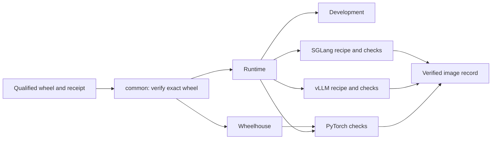

# Containers for AITER and its frameworks

AITER images carry the wheel that passed qualification. A framework can copy that wheel into its own approved base without rebuilding AITER or replacing its Torch and Triton dependencies.

| Directory | What it builds |
|---|---|
| [common/](common/README.md) | Runtime, development and wheelhouse stages, plus the shared wheel verifier and installer |
| [pytorch/](pytorch/README.md) | The wheel in a compatible PyTorch environment; also tests wheelhouse inheritance |
| [vllm/](vllm/README.md) | The same wheel in an approved vLLM environment |
| [sglang/](sglang/README.md) | The same wheel in an approved SGLang environment |

[images.json](images.json) connects each recipe to its qualification profile. The primary Python 3.12 / ROCm 7.2 wheel must pass both vLLM and SGLang inheritance checks for each advertised product image role. Adding a recipe without an executable profile cannot satisfy this registry.



The [pipeline application](../ci/pipelines/README.md) owns build, execution, evidence and cleanup. `.github/workflows/release-images.yaml` selects workers and transfers artifacts; it calls that application instead of implementing another Docker test loop. Publication runs in a separate job and restores the tested archive without rebuilding it.

For a manual image build, place the exact wheel in `dist/` and use its receipt hash:

```bash
docker build -f docker/common/Dockerfile --target runtime \
  --build-arg BASE_IMAGE='approved/rocm-pytorch@sha256:THE_BASE_DIGEST' \
  --build-arg AITER_WHEEL='amd_aiter-VERSION-cp312-cp312-linux_x86_64.whl' \
  --build-arg AITER_WHEEL_SHA256='THE_WHEEL_SHA256' \
  --build-arg AITER_SOURCE_REVISION='THE_FULL_SOURCE_SHA' \
  -t aiter-runtime:candidate .
```

`BASE_IMAGE` must supply the matching runtime dependencies. The common installer verifies one declared wheel, rejects extra or changed wheelhouse files and installs with `--no-deps`. Copying a wheel is preferable to moving an installed `site-packages` directory across Python or ROCm versions.

Prepared HIP/CK provider tests prove execution without compilation. Existing framework bridges may still compile their matching legacy kernel when the wheel lacks that AOT variant. Their approved base must therefore provide that toolchain, or the wheel must contain the required prebuilt variant. A successful image build is followed by actual framework checks; it is not itself a serving or model-accuracy result.

Building these images needs a Docker daemon. Running their GPU profiles also needs ROCm device access. CPU tests exercise installer, controller, archive and evidence rules; they do not substitute for image execution on the configured workers.
