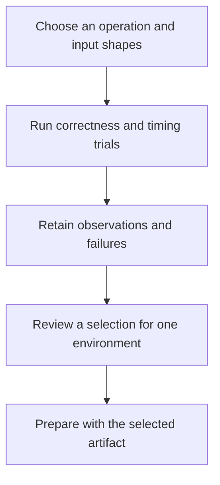

# From a tuning experiment to a reviewed selection

Tuning asks a narrow question: for this operation, shape, dtype and machine, which tested implementation performs best? A fast measurement is useful only if the result is correct and the environment is recorded.

## Find the implementation

The maintained search programs live under `aiter/tuning/search/`, grouped by operation and implementation family. Their [command registry](../aiter/tuning/search/README.md) lists the entry points. Native sources stay under `csrc/`; they are inputs to the build, not the location of the Python tuning controller.

The [Triton search guide](../aiter/tuning/search/triton/README.md) explains the subprocess sweep, timing observations and result inspection. A failed or unmeasured trial is not a usable timing result. The [benchmark guide](../benchmarks/README.md) explains paired comparisons and reference checks.

## Understand the two configuration paths

Existing specialized operators still consume their established CSV schemas. The library resolves those inputs without rewriting tracked files during import. A tuner can produce a candidate CSV for review; its existence does not make every row a newly validated result.

Prepared execution can instead bind a reviewed dispatch manifest to an exact request, target, environment and artifact. See [tuning and selection](../aiter/tuning/README.md). It is not an online optimizer: the execution path does not search for a faster kernel or rewrite the selection while serving requests.

## Run and review through CI

The operator tuning workflow is a manual experiment entry point. The separate tuning test workflow checks the tuning infrastructure. Their current definitions are [product-tuning.yaml](../.github/workflows/product-tuning.yaml) and [product-tuning-validation.yaml](../.github/workflows/product-tuning-validation.yaml); inspect their declared inputs before starting a run.

For product and framework acceptance, choose an explicit [qualification profile](../ci/README.md). Keep the candidate observations, correctness outcomes, environment and comparison alongside the proposed configuration change. Publishing a wheel or advancing a channel is a separate delivery decision.
