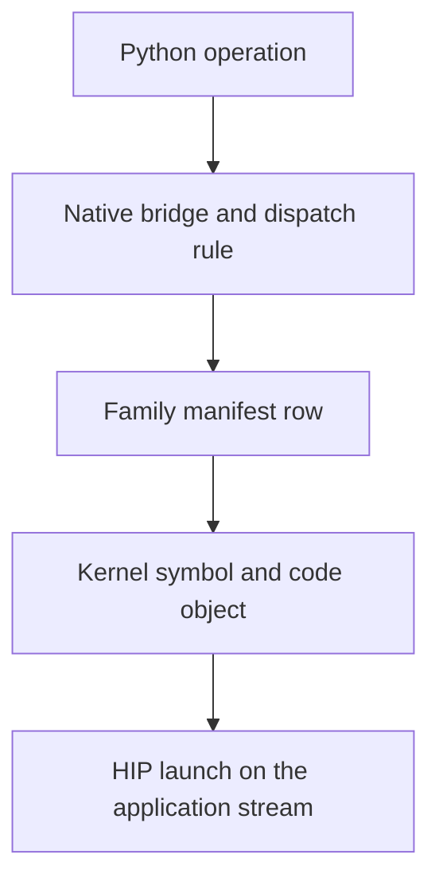

# Inspect a native code object

AITER ships assembly kernels as AMDGPU ELF code objects under `kernels/<architecture>/<family>/`. A dispatch table chooses a symbol and code object for a particular operation. Inspecting those files helps explain the leaf that runs; it does not establish that a replacement is correct or faster.

## Trace the selected artifact

Start from the Python operation and its native bridge under `csrc/py_itfs_cu/`. Follow the selected configuration into the family's CSV manifest and `.co` file. Registered generators under `aiter/codegen/assembly/` turn those declarations into build inputs; see [code generation](../aiter/codegen/README.md).



The [native cache guide](../aiter/jit/README.md) explains source resources and installed bundles. Lazy `import aiter` does not initialize every native loader. Inspect the resource selected by the actual operation, rather than assuming a shell variable or a historical source path controls it.

## Read the artifact without changing it

These commands inspect one shipped gfx942 paged-attention object from the repository root. They need the LLVM utilities supplied by a ROCm installation; they do not launch a GPU kernel.

```bash
/opt/rocm/llvm/bin/llvm-readelf --notes \
  kernels/gfx942/pa/pa_bf16_pertokenFp8_gqa16_2tg_4w.co
/opt/rocm/llvm/bin/llvm-objdump -d --mcpu=gfx942 \
  kernels/gfx942/pa/pa_bf16_pertokenFp8_gqa16_2tg_4w.co
```

The instructions, symbol table, kernel descriptor and metadata answer different questions. Instructions show arithmetic and memory operations; the descriptor and metadata describe resources and argument layout. Check all of them when investigating an ABI or launch mismatch.

## Keep experiments separate from qualified artifacts

The [experimental inspection helpers](examples/isa_optimization/README.md) can extract an assembly representation and compare a reassembled object. Reconstruction depends on the original assembler and the selected LLVM version; no general byte-identical round-trip guarantee is made.

Write experimental output into a scratch directory. Do not overwrite a shipped object while treating its earlier digest or qualification result as valid. A changed artifact requires a new build identity, numerical and lifetime tests, and a measured comparison on the intended target. Use the normal build and qualification paths to make that change reviewable.

The earlier version of this guide described replacing source-tree objects directly and claimed broad toolchain verification. Those instructions and claims are not part of the maintained workflow.
