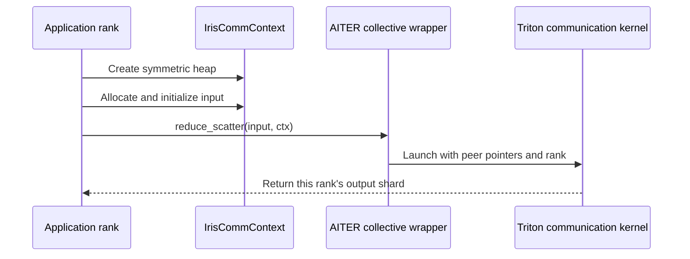

# GPU communication with Iris

AITER has an optional set of Triton communication operations backed by Iris. They use GPU-accessible symmetric memory shared among ranks. This interface is separate from the prepared single-device runtime and from the native collective implementation.

Install the optional dependency in an environment compatible with your GPU and Triton versions:

```bash
python -m pip install -e '.[triton_comms]'
```

The dependency revision is declared in [requirements/runtime/iris.txt](../requirements/runtime/iris.txt). Importing this operation family without Iris raises an import error; ordinary AITER metadata imports do not require it.

## Follow a collective call



Each participating process must first select its local GPU and initialize the distributed process group. All ranks must execute matching collective calls. Allocate inputs through the context's Iris allocator and initialize their contents before launching a collective.

The explicit imports are:

```python
from aiter.ops.triton.comms import (
    IrisCommContext,
    all_gather,
    calculate_heap_size,
    reduce_scatter,
)
```

`reduce_scatter(input_tensor, ctx=ctx)` sums across ranks and returns a row shard. `all_gather(input_shard, ctx=ctx)` collects the row shards. These wrappers require an initialized context; they do not create the process group for you. Read the exact [reduce-scatter wrapper](../aiter/ops/triton/comms/reduce_scatter.py) and [all-gather wrapper](../aiter/ops/triton/comms/all_gather.py) before choosing shapes or launch parameters.

## Size and lifetime of the heap

`calculate_heap_size(M, N, dtype, world_size=..., quant_mode=..., all_gather=...)` estimates storage with an overhead factor. It is not a guarantee for an arbitrary sequence of allocations. Include the operations and buffers that remain live together, and measure memory use in the intended workload.

[IrisCommContext](../aiter/ops/triton/comms/iris.py) owns the Iris object used by these wrappers. Its current context-manager exit does not explicitly destroy that object. Keep the context alive while kernels or returned buffers can still use its allocations, and follow Iris's process and memory lifetime requirements. The [communication integration tests](../tests/README.md) identify the separately tested native collective scope; their result does not certify this optional Iris path.
