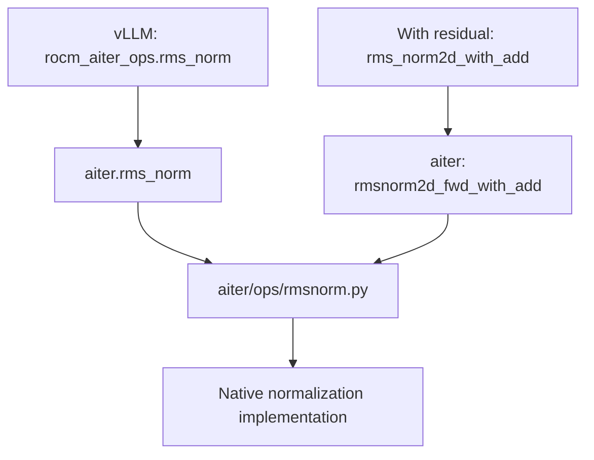
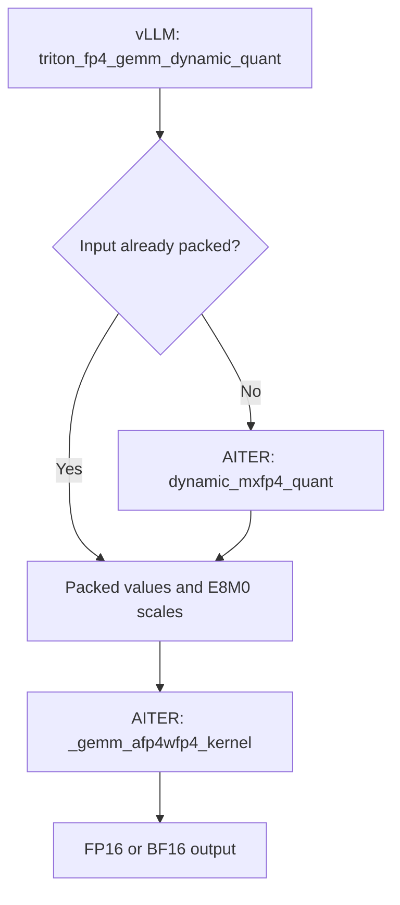
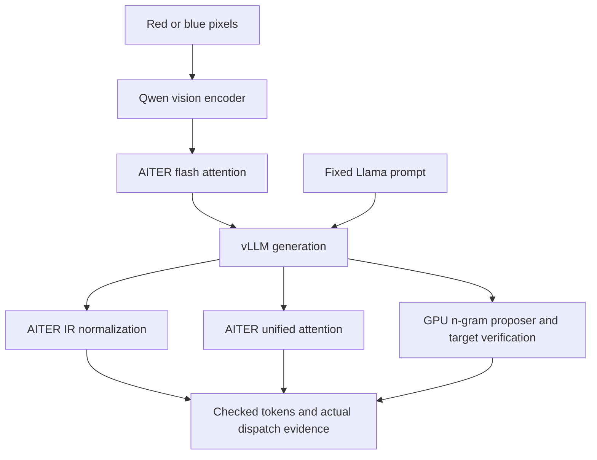
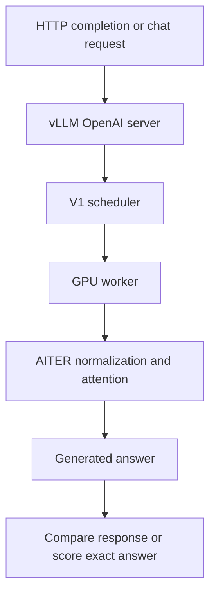
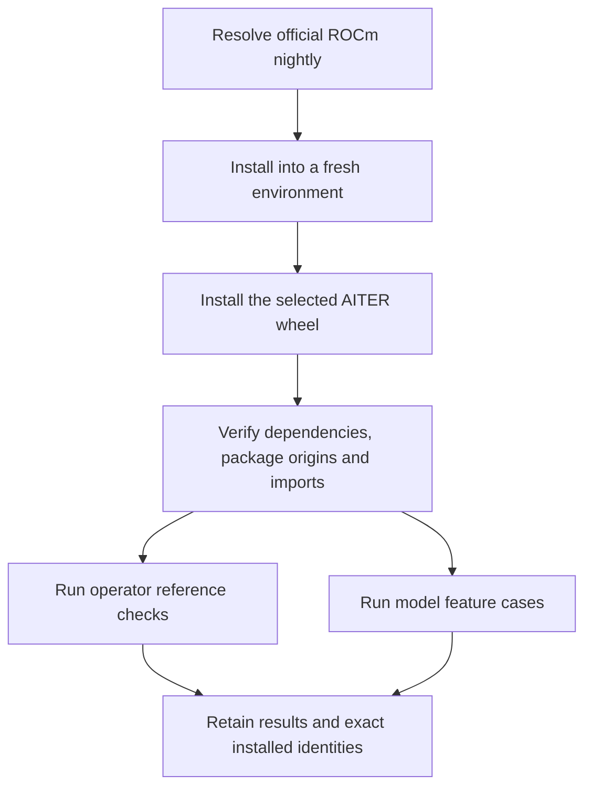
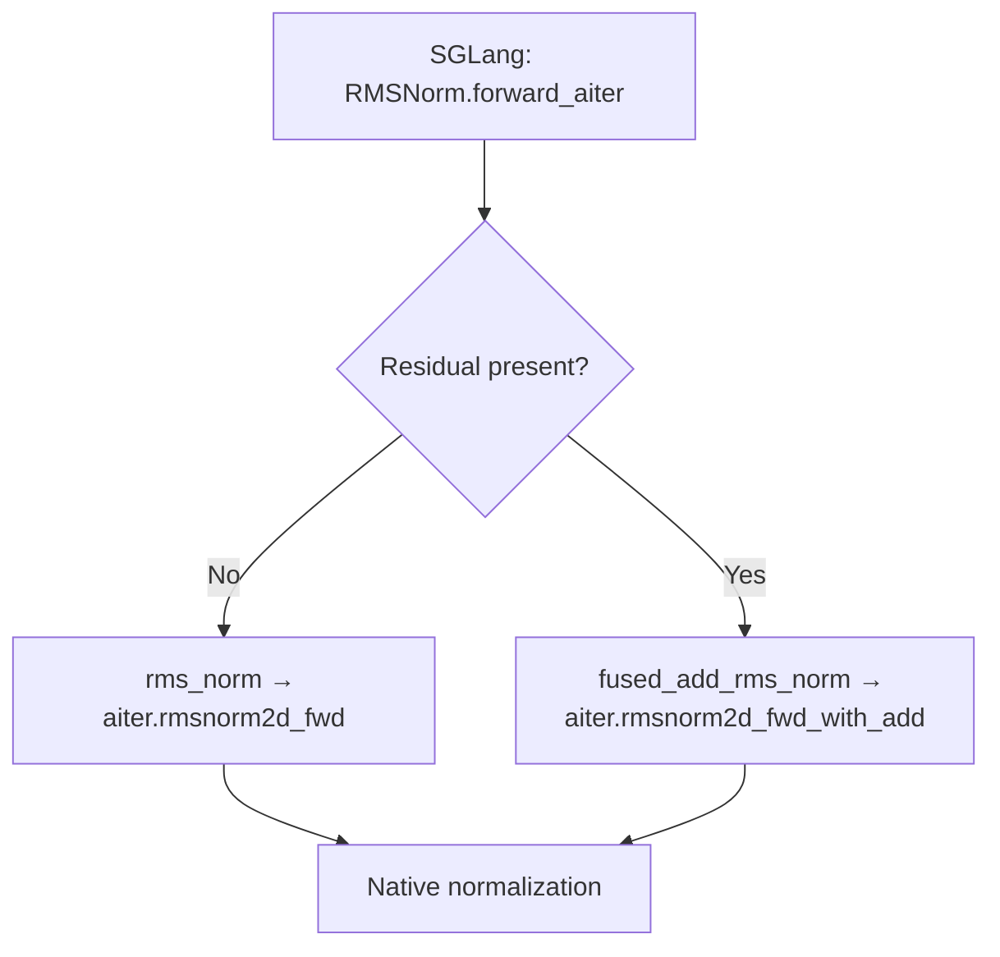

# Follow a framework call

A framework decides which operation its model needs. Its AITER adapter translates the framework's tensors and options into an AITER call. AITER then reaches a native or DSL implementation. Enabling a framework flag does not tell you which of those paths ran.

Start with an operator bridge to understand one call. Then use a real model case to see whether those operations work inside generation. The repository keeps operator bridges under `tests/frameworks/vllm/operators/` and model cases in feature areas such as `generation/`, `attention/` and `distributed/`. The [area guide](../../tests/frameworks/vllm/README.md) gives each acceptance condition.

## vLLM: normalization

The bridge test imports `rocm_aiter_ops` from `vllm._aiter_ops` and calls its normalization method. It observes the real AITER entry point and compares the output with independent FP32 math.

Read [the bridge test](../../tests/frameworks/vllm/operators/normalization/test_rmsnorm.py) to see the exact arguments, call observation and reference. The framework is using a compatibility entry point here. It is not implicitly calling `Runtime.prepare_rmsnorm`.

## vLLM: ordinary MXFP4

The FP4 bridge has two paths. It quantizes an ordinary input when scales are absent, or accepts already packed input when scales are provided. Both paths reach the same Triton GEMM leaf.

The physical input contains two E2M1 values per byte and one E8M0 scale per group of 32 values. vLLM passes the weight scales transposed relative to AITER's ordinary prepared descriptor. That transpose is part of the adapter's job; it is not a different mathematical quantization scheme.

[The actual leaf-tracing test](../../tests/frameworks/vllm/operators/quantization/test_mxfp4.py) observes Triton's launch boundary, checks both paths, and independently decodes packed values before computing the reference. See [matrix formats](../api/gemm.rst) and [the runtime guide](../../aiter/runtime/README.md#use-ordinary-mxfp4-on-gfx950) for the buffer layouts.

## vLLM: real image and speculative generation

The [model suite](../../tests/frameworks/vllm/runtime/README.md) loads pinned published weights through vLLM's `LLM.generate`. Its Qwen2.5-VL case gives the same prompt two different images and requires the answer to change from red to blue. Its Llama case compares all greedy output tokens between ordinary generation and GPU n-gram speculation, then requires nonzero proposed and accepted draft tokens.

The [worker](../../tests/frameworks/vllm/runtime/worker.py) installs an observer in each GPU process before loading the model. The engine explicitly selects AITER's normalization priority and unified-attention backend: in the inspected vLLM checkout, the global AITER flag alone left normalization on another implementation. The [execution helper](../../tests/frameworks/vllm/runtime/execution.py) verifies imported package bytes and requires successful AITER calls and kernel launches from the workers.

The suite also checks ordinary batching, prefix-cache reuse, captured decode, two-GPU tensor parallelism and online per-channel FP8 inference. Each has its own assertion. A graph case must replay a graph containing AITER work; a two-GPU case must observe both ranks on distinct devices. An FP8 case inspects real quantized projection weights and requires AITER GEMM calls.

Model cases target gfx950 with pinned Qwen2.5-VL, Qwen3 and Llama weights. FP8 uses vLLM's `fp8_per_channel` mode, whose per-channel weights and per-token activations match the selected AITER linear path. The [model guide](../../tests/frameworks/vllm/runtime/README.md) states the exact scope and commands.

## vLLM: serving, evaluation and scheduling

The server tests start a real loopback OpenAI-compatible server, send completion and chat requests, compare streaming with complete responses, and check recovery after an invalid request. They observe the GPU worker that generated the answers. The language-quality group uses the same server to score pinned GSM8K questions against their exact final answers. Qwen3 also has a separate Transformers comparison for greedy tokens and every prompt-token likelihood.

The chunked-prefill test observes the scheduler's actual token allocation and requires multiple prefill steps while preserving the output. The weekly profile adds a disjoint GSM8K slice, reused and reordered images, FP8 likelihood comparisons and speculation with both accepted and rejected drafts. [The upstream selection guide](../../ci/clients/vllm/upstream/README.md) maps these cases to vLLM's CI areas and lists the unported scope. Multi-node inference and the full upstream model matrices remain outside this bounded port.

## Start with a freshly installed nightly

The [nightly pipeline](../../ci/clients/vllm/README.md) resolves the current official ROCm wheel, creates a private Python environment and installs its dependencies. It then installs the selected AITER candidate and verifies imports before admitting any numerical workload.

The consumer may pin a released AITER version. Candidate testing makes that one replacement explicit and keeps the original dependency-check result. Other unmet dependencies still stop the run. A passing rolling-nightly development run does not automatically become a supported release environment.

## SGLang: normalization

SGLang's `RMSNorm.forward_aiter` uses its imported normalization bridge. The test requires `SGLANG_USE_AITER=1` before importing the client, verifies that the selected function is AITER's actual function, and exercises both ordinary and residual normalization.

[The SGLang bridge test](../../tests/frameworks/sglang/test_rmsnorm.py) names the inspected upstream revision. A supported client profile also needs its exact dependency environment and observed package identity. A successful small bridge check does not resolve missing dependencies for a full server.

## Find the path for your workload

1. Identify the framework operation and its adapter call. Model names alone do not identify a kernel.
2. Check the tensor shape, dtype and physical layout, including scale grouping and any weight shuffling.
3. Use `python -m aiter operators` to locate the owning AITER domain and its available interfaces.
4. Follow the wrapper to its declared build recipe or DSL leaf. A prepared plan's `explain()` gives the selected provider and artifact identity.
5. Run the appropriate framework profile and inspect the recorded import origin and actual call evidence.

The [test layout](../../tests/README.md) explains the shared helpers and separate client directories. The [CI guide](../../ci/README.md) explains profile selection and the distinction between bridge tests, full-model canaries and release qualification.
