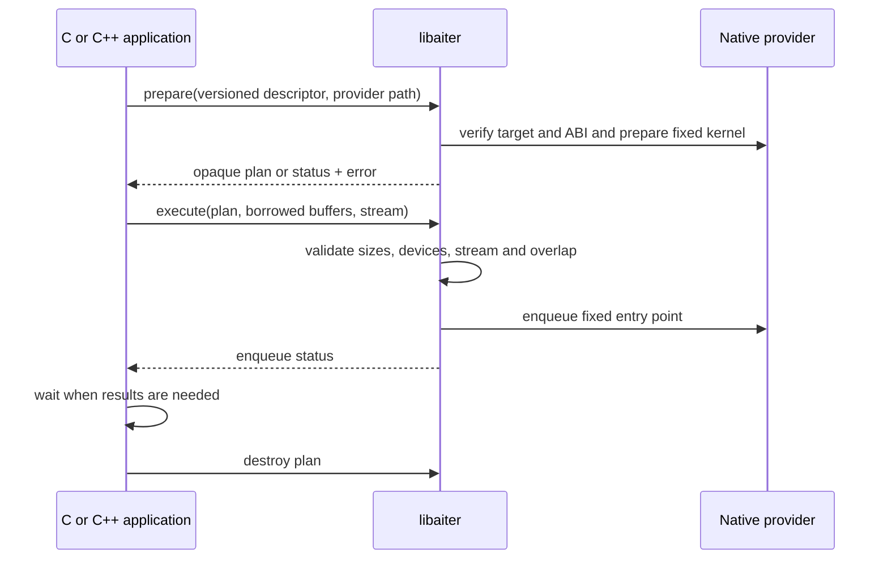

# Native C SDK

The public header is [`aiter.h`](aiter.h). The SDK prepares and executes RMSNorm and ordinary FP8 blockscale GEMM on gfx950 using native HIP and CK providers. Its process does not need Python or Torch. ABI version 1 describes this interface; it is not a claim that every historical AITER operator has a stable native ABI.

Build with the ROCm compiler and the pinned CK submodule:

```bash
git submodule update --init 3rdparty/composable_kernel
cmake -S . -B /tmp/aiter-sdk -DCMAKE_BUILD_TYPE=Release \
  -DCMAKE_HIP_COMPILER=/opt/rocm/lib/llvm/bin/clang++
cmake --build /tmp/aiter-sdk -j2
ctest --test-dir /tmp/aiter-sdk --output-on-failure
/tmp/aiter-sdk/aiter_rmsnorm_example /tmp/aiter-sdk/libaiter_rmsnorm_backend.so
cmake --install /tmp/aiter-sdk --prefix /tmp/aiter-install
```

An external CMake consumer can use `find_package(aiter CONFIG REQUIRED)` and link `aiter::aiter`. Set `CMAKE_PREFIX_PATH=/tmp/aiter-install`. A consumer that allocates HIP buffers also links HIP itself. The providers install under `lib/aiter`; their paths are explicit preparation arguments.



Provider bytes are copied into a sealed Linux memfd during preparation and retained by exact content. Replacing a file at the same path cannot make a new plan silently reuse the previous binary. Identical bytes share one process-lifetime snapshot.

The descriptor fixes dimensions, dtype, device and numerical parameters. Every buffer includes its size in bytes. The SDK rejects incompatible descriptors, insufficient storage, output aliasing, foreign-device buffers and foreign-device streams. It does not allocate application tensors or silently select another provider after failure. Error text is thread-local; copy it before another SDK call if it must be retained.

Execution is asynchronous. The caller retains buffers and streams until queued work completes and observes completion errors through HIP. Captured graphs retain their data dependencies separately; the loaded executable remains resident so replay remains valid after the preparation handle is destroyed. Plans can be shared for read-only execution with independent output buffers; destruction must not race an executing host call.

RMSNorm accepts FP16, BF16 and FP32, positive finite epsilon, and an explicit input row stride. GEMM accepts E4M3FN values, ordinary FP32 scales in 128-element blocks, and FP16/BF16 output. Its current fixed CK tile requires M divisible by 16, N by 128 and K by 256. Unsupported configurations return `AITER_UNSUPPORTED` before launch. The Python DSL providers offer additional shapes; they do not extend this native profile automatically.

Run the independent native acceptance program with two visible GPUs:

```bash
HIP_VISIBLE_DEVICES=0,1 /tmp/aiter-sdk/aiter_native_tests \
  /tmp/aiter-sdk/libaiter_rmsnorm_backend.so \
  /tmp/aiter-sdk/libaiter_ck_backend.so
```
