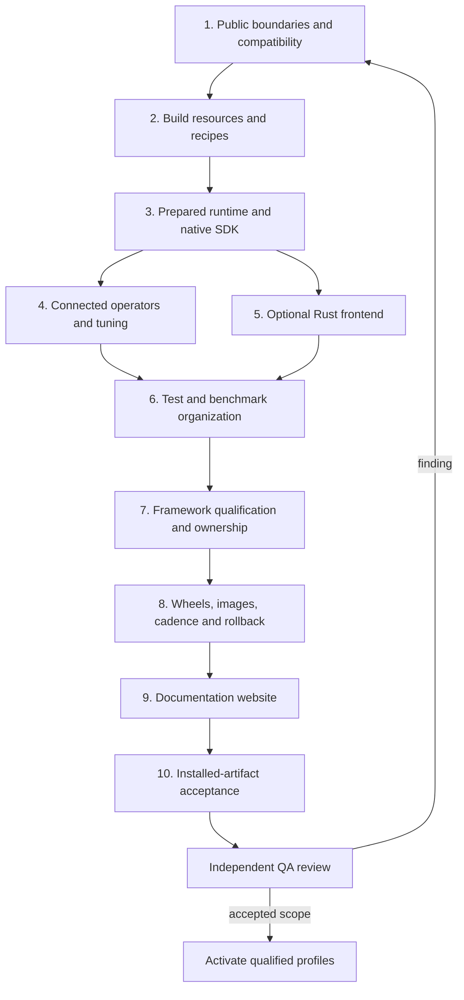

# Review and rollout

The implementation branch is `akaratza_aiter_implementation`, based on `456b92780c8b650c1e3e4b0fa1ca21f0d1fb363d`. The latest request authorizes an AITER fork, a push of this branch and a documentation website after local validation. That publication is separate from promoting a supported AITER package or image. The proposal rewrite is published in its separate repository; the manual is unchanged in this round.

This file gives the review boundaries for introducing the connected implementation in several PRs. [ARCHITECTURE.md](ARCHITECTURE.md) describes the resulting system; [notes.md](notes.md) records file responsibilities, review findings and test evidence.

## Workflow and vLLM follow-up

Review the September 7 follow-up in three connected changes. First, land the organized workflow sources with their generator, tests, CODEOWNERS rules and generated GitHub files. Preserve execution filenames so existing reusable calls and required checks remain valid. Second, land the expanded model scenarios with their shared execution helpers, case selection and required profile counts. Third, land configurable benchmark workloads, their evidence checks and the workflow inputs that select them. Each change includes its directory guide and website navigation.

The [engineering record](notes.md#september-7-workflow-directories-and-broader-vllm-workloads) records failures and local checks. The new generation check must pass before a workflow change lands. Required model cases must execute with observed AITER work, and benchmark presets must distinguish a completed measurement from a performance improvement or a supported model claim. Configuring more cases is not a substitute for running them on the declared hardware.

## Ordered PR rounds

| Round | Reviewable implementation | Acceptance condition |
| --- | --- | --- |
| 1 | Lazy compatibility exports, CPU-only descriptions and diagnostics, domain catalog, executable dependency and layout policy | Every baseline export resolves; callable arguments/defaults preserved; documented canonical enum annotation namespace; forbidden dependencies rejected, including relative and literal dynamic imports |
| 2 | Explicit resource layout, `aiter/kernels/data`, managed admission, generators and recipes, BLAS bridge consolidation, JIT services, immutable build plan/controller, bounded generated-source batches and named prebuilds | Metadata changes no source files; source and wheel use the same modules/resources; every original instantiation is accounted for; build selections and per-source flags remain explicit; failed workers and missing inputs fail visibly |
| 3 | `aiter/api`, runtime composition, operation adapters, shared native artifact resolver, C ABI and installed CMake SDK | Actual native and DSL numerical results; support and preparation use the same registration; invalid layouts/resources rejected; explicit device/stream/lifetime rules; no compilation, scratch allocation or implicit synchronization during prepared execution |
| 4 | Shared-buffer operation chains, ordinary MXFP4 layouts, immutable tuning manifests and legacy-table migration | Connected graph replay and changed inputs; exact packed-format checks; measurements retain provenance; runtime selection stays pinned; reads do not modify source tables |
| 5 | `bindings/rust` over the C ABI | Installed external consumer, ABI offsets, !Send/!Sync checks, explicit unsafe enqueue lifetimes, actual GPU results, both lib and lib64 layouts |
| 6 | Domain-owned operations and development helpers, shared hardware/model/process fixtures, one `tests` hierarchy, separate operator and vLLM model measurements, trace analysis and centralized dependency inputs | Framework subdirectories and shared helpers; downstream import identity preserved; actual benchmark parser/build/output checks; broad collection plus bounded numerical regressions |
| 7 | Explainable catalog/planner, reviewed client registry, per-framework profiles, vLLM operator/model/serving/evaluation areas, strict evidence and ownership generation | Actual product and consumer calls; pinned inputs; fresh caches and observed resource origins; missing, forged, changed or skipped required evidence rejected; effective CODEOWNERS precedence verified |
| 8 | Trusted release controls, candidate isolation, common pipeline executor, consumer container directories, image composition, cadence and history | Same tested bytes carried forward; framework images use their declared profiles; incomplete matrices and failed publication retries cannot advance a channel; rollback preserves history |
| 9 | Canonical-guide website, responsive layout, searchable navigation, local source links and expanded diagrams | Warning-fatal build plus actual desktop/mobile browser checks; no clipped table cells, broken local links, diagram errors or required off-site assets |
| 10 | Frozen source/control snapshots, source archives, fresh wheel installation, source and installed-package acceptance | Reconstruct passing reports for the exact current candidate; rerun affected tests after findings; distinguish local development evidence from supported release qualification |

The rounds depend on each other. For example, the generator move includes its resource manifest and recipe changes; the benchmark move includes its imports, test adapters and CI references. Extracting a file move without its callers would produce an unusable intermediate PR. Every round should carry its own tests and explanatory migration note.

The earlier `aiter_contracts` and `tools/quality` design has been removed. Runtime descriptions live inside the library. Qualification and delivery are explicit applications under `ci`. GitHub workflow files stay directly inside `.github/workflows`, as GitHub requires, and use `host-`, `product-`, `client-` and `release-` prefixes. Qualified source/wheel/image execution and the vLLM/SGLang canaries use the shared pipeline application. Specialized legacy kernel and multi-service topology workflows retain their own procedures; the [workflow index](.github/workflows/README.md) makes that scope visible.

## Acceptance history and the current review

The results in this section describe the earlier artifact and framework snapshots. The September 7 expansion and its current selection counts are recorded in the [workflow and vLLM follow-up](#workflow-and-vllm-follow-up) and its linked engineering record.

The latest [ownership and consumer review](notes.md#package-ownership-consumer-coverage-and-documentation) extends rounds 1, 2, 6, 7 and 9. Canonical operation moves must include downstream compatibility and every first-party caller. The kernel data move must include source archives, wheel resources, generators and ownership rules. Compiler batching must land with the complete instantiation ledger, a baseline mode and numerical/build measurements. Moving a shell helper must include its workflow callers and script inventory.

Daily vLLM coverage now declares 19 workload groups; the weekly extended profile contains those same groups plus four broader checks. A separate import gate precedes both. The final extended run may establish the daily subset only when the selected group definitions are identical. The real-model benchmark uses the same installed-nightly prerequisite but remains an advisory measurement with its own workload and raw samples.

The new [fresh installed vLLM acceptance](notes.md#fresh-installed-vllm-acceptance) passes all 23 extended workload groups plus import: 90 cases with no failures or skips. Independent reconstruction verifies the identical 19-group daily subset without claiming a second execution. This covers the actual rolling framework installation, eight operator groups and 15 model groups, including serving, evaluation, Qwen3, vision, speculation and two-GPU execution.

The current ordinary wheel passes 267 installed checks, all 601 public exports and 547 signatures. Clean Python 3.10 and 3.12 environments each pass 542 host cases and 775 subtests. The installed product profile adds 47 passing GPU cases. Its exact source archive, wheel, controls and retained failed attempts are in [the current artifact record](notes.md#current-installed-artifact).

The full cold LayerNorm build comparison takes 196.80 seconds with bounded source batches, down from 504.79 seconds for the original separate units. Both binaries pass the same 64 numerical cases. This is a measured improvement for one family on this machine, with the memory and compiler-command limitations recorded in the engineering notes.

The expanded website has 202 pages. Its packaged archive passes 438 browser views and 63 additional views under the project URL prefix; all 431 visible served files match their artifact bytes. The review fixed a real Pages exclusion issue that dropped workflow-source links, with nine website unit tests and an independent 256-path archive check. The documentation workflow publishes the checked artifact from this implementation branch. Its run records remote deployment separately from local acceptance.

The real-model benchmark also executes successfully in the accepted private nightly environment: two warmups and nine measurements of a fixed Llama 3.2 1B workload, with exact dependency identities retained before and afterward. Median batch latency is 329.37 ms. This is an advisory measurement; it does not claim a second installation, an OCI run or a regression threshold against another release.

The September 5 candidate passed local review and execution on gfx950. Independent QA reconstructed its product and nightly profiles, including eight-GPU communication and Rust, plus packaging, installed-wheel and framework checks. [That historical acceptance record](notes.md#september-5-acceptance) gives exact identities, counts, failed attempts and subsequent fixes.

The [September 6 review](notes.md#september-6-architecture-and-website-review) changes runtime/build composition, pipeline execution and the website. Its current acceptance includes 368 host tests, a 231-case source selection, a 233-case installed selection, fresh SDK checks and independent archive verification. The website has separate browser evidence for its actual rendered output. These scopes overlap and do not replace every earlier nightly or model profile. The PR boundaries above reflect the expanded design; release activation remains separate.

The [subsequent resource and model review](notes.md#september-6-kernel-resources-and-real-model-coverage) expands rounds 2, 6 and 7. Resource moves must land with their manifest, generators, native admission and packaging callers. Client registry changes must land with profile selection, copied-suite support and required model provisioning. A passing bridge or image-composition profile does not substitute for the new real-model cases.

The corrected resource/model round now has a passing copied host profile (434 tests and 559 subtests), 244 installed checks, independent wheel/source-archive verification, and both real vLLM model cases through the sealed runner. [The acceptance record](notes.md#corrected-local-acceptance) identifies the exact wheel, failed first attempt and supported scope. The subsequent interpreter-policy correction has its own passing 438-test copied host report against that unchanged candidate. This is local gfx950 development evidence; it does not activate registry publication or qualify GPU containers and other hardware.

The [feature-area and nightly round](notes.md#september-6-feature-areas-and-fresh-consumer-nightlies) extends round 7 with an explicit installation/import prerequisite, eight operator groups, seven model scenarios and independently checked worker evidence. Eight bounded product groups join `product-fast`, daily `product-nightly`, Saturday `product-extended` and their own `product-features` profile. The candidate replacement, dependency observation and checked report must land together; removing the observation would turn the nightly into an unverified environment test. The MoE layout rejection and attention-threshold correction belong with their regression cases and migration guide.

The current feature round has a complete passing installed product profile: 498 host cases, 701 subtests and 47 GPU cases with fresh caches. This includes the stronger paged-attention oracle found during independent review. The exact wheel, controls and earlier attempts are in [the frozen acceptance record](notes.md#frozen-product-acceptance). Both clean Python 3.10 and 3.12 host environments also pass all 498 tests and 701 subtests. Framework nightly acceptance is recorded separately because it installs and observes a different consumer environment; a product pass cannot substitute for that step.

The fresh current-nightly installation also passes: one import gate, all 73 operator cases and all seven real model scenarios. [The accepted run](notes.md#accepted-current-nightly-run) records the exact upstream revision, candidate bytes, reports and observations. It is local gfx950 development evidence with an explicit candidate-pin replacement; Docker execution and supported release activation remain separate gates below.

Ordinary wheels still compile some legacy operations on first use; the earlier fresh normalization builds each took about 33 minutes with two workers. That measured build cost is separate from runtime performance.

## Supported execution interfaces

The prepared Python interface covers RMSNorm, grouped FP8 quantization, ordinary FP8 blockscale GEMM, rotary embedding, dense attention, MXFP4 quantization and ordinary MXFP4 GEMM. The C and Rust interfaces cover the native RMSNorm and CK GEMM SDK profile. Each advertises its exact layout and target restrictions.

The complete existing operator interface remains available through its documented domains and compatibility exports. Paged/MLA/sparse attention, expert routing/MoE, recurrent updates, sampling and communication retain their specialized interfaces. A compatibility guarantee is not a promise that every existing operation has acquired a new prepared state/workspace/communicator lifecycle. Extending that promise is a separate capability change with its own implementation and evidence.

For each future capability:

1. Define the tensor layout, numerical behavior, state ownership and allowed aliasing.
2. Implement support and preparation against a real leaf kernel; preserve application buffers during preparation.
3. Specify workspace, stream, capture, completion and lifetime behavior before advertising it.
4. Test numerical results, invalid inputs and state transitions; include distributed failure behavior when relevant.
5. Connect an actual consumer, its qualification group and its owner.
6. Have independent QA challenge the boundary, fix the findings and record the accepted support scope.

## External activation gates

These are release requirements, not permissions requested for the local work.

| Gate | Evidence or configuration needed |
| --- | --- |
| Hardware | Execute the advertised gfx942 profiles on gfx942 workers; this machine supplies gfx950 evidence |
| Supported environments | Approved immutable ROCm/Python/client locks and images for each declared matrix cell |
| Container execution | Real Docker builds, GPU image checks and downstream inheritance on a worker with a usable engine |
| Framework coverage | Qualify broader serving, accuracy, performance and multi-node canaries; the current bounded model cases do not cover every model, proposer or deployment topology |
| Responsibility | Accepted primary/backup maintainers, verified access and configured review rules |
| Publication | Reviewed immutable controls, isolated workers, registry access and protected publication environments |
| Release guidance | Reviewed compatibility, upgrade steps, known issues, support dates and rollback instructions for the actual version |

Daily qualification has 14 base installed-wheel cells; stable has 38. A product environment that explicitly includes FlyDSL also requires its FlyDSL qualification cell. An environment that declares FlyDSL unused cannot qualify a wheel containing a FlyDSL bundle. A failed or unavailable cell cannot be replaced by a source test or a result from another wheel/environment. Channel history keeps the failed attempt and the previous qualified reference separately.

The local design steward is `@AndreasKaratzas`. `python -m ci.ownership.policy ready` reports unassigned upstream responsibilities. No local file can make someone accept an ownership role or enable a remote repository rule.
