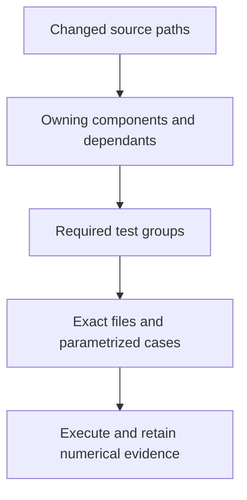

# Where to add a test

Choose the behavior being checked, then the owning subsystem. Product tests belong to AITER independently of any framework. Framework tests exercise a real consumer adapter and prove which AITER entry point it reaches.

| Directory | Purpose |
|---|---|
| `unit/architecture/` | Dependency direction and package boundaries |
| `unit/runtime/` | Descriptors, policies, validation and preparation metadata |
| `unit/build/` and `unit/codegen/` | Build identity, packaging and generator rules |
| `unit/tuning/` and `unit/benchmarks/` | Selection records and measurement validation |
| `unit/ci/` | Planning, execution evidence, environment locks and release gates |
| `integration/runtime/` | Real GPU operators, connected pipelines, capture and streams |
| `integration/packaging/` | Cold imports, installed wheels, generators and generated native launcher consumers |
| `integration/communication/` | Real multi-GPU communication and cleanup |
| `integration/sdk/` | C/C++ and Rust callers, ABI validation and library lifetime |
| `operators/hip/`, `operators/triton/`, `operators/flydsl/`, `operators/opus/` | The broad operator regression inventory by implementation family |
| `frameworks/pytorch/`, `frameworks/vllm/`, `frameworks/sglang/` | Client adapters; vLLM also has model, serving, evaluation and execution areas |
| `frameworks/common/` | Shared client prerequisites, reference math and call tracing |

Operator pytest cases and standalone CLI drivers have different execution adapters. Backend `drivers/` directories contain programs with their own argument parser and case loops; they are run explicitly, not imported for pytest discovery. Performance workloads live in [`benchmarks/`](../benchmarks/); unit tests here validate their measurement rules.

## Choose the scope

A test area answers a behaviour question. A group selects the exact files or cases to execute. A profile combines groups for a product or consumer. The planner expands changed components to their dependants; shared or unmapped changes select the complete profile.



| Profile | Use it for |
| --- | --- |
| `host` | Architecture, packaging, CI controls and shared harness rules without GPU dependencies |
| `product-features` | Bounded position, routing, recurrent state, paged addressing, dense GEMM and sampling checks |
| `product-fast` | The product gate, including those bounded feature checks on eligible hardware |
| `product-nightly` | Daily installed-wheel product selection, including the bounded feature groups |
| `product-extended` | The scheduled broad product and distributed selection |
| `legacy-regression` | Broad backend inventories, including the full Triton GEMM area; an unavailable specialization remains visible |
| `vllm-import` | Verify the selected installed consumer and candidate before GPU execution |
| `vllm-nightly` | Eight operator groups and eleven model/serving/evaluation groups, after the separate import gate |
| `vllm-extended` | Every daily group plus held-out evaluation, image ordering, FP8 likelihood and mixed speculation checks |

The [vLLM area guide](frameworks/vllm/README.md) separates serving, language and multimodal models, evaluation, generation, attention, execution, distributed inference and quantization. Shared execution mechanics belong to its `runtime/`; assertions belong to the feature they test. Other clients keep their own areas and use `frameworks/common` for shared references and tracing. The [upstream selection guide](../ci/clients/vllm/upstream/README.md) explains which vLLM jobs informed the bounded port.

Inspect what is selected before interpreting a pass:

```sh
python -m ci coverage --client vllm
python -m ci coverage --client aiter --format json --output /tmp/aiter-selection.json
python -m ci plan --profile product-features --output /tmp/aiter-plan.json
python -m ci run --plan /tmp/aiter-plan.json --output-dir /tmp/aiter-run --gpus 0,1
```

The coverage command inventories **declared test selection**. It shows node restrictions, profile membership, unselected files and opaque script adapters. It does not execute tests or claim that a selected file covers every shape, format or feature. The runner's checked report supplies execution evidence.

## Add a case

1. Put the assertion under the behaviour it checks. Use independent reference math or a controlled model outcome, and assert every numerical comparison.
2. Use shared capability markers and fixtures. Required qualification must fail an unavailable prerequisite instead of silently skipping.
3. Add the exact selector and capability requirements to its owning group: product groups live in `ci/qualification/catalog.json`; client groups live under `ci/clients/<client>/`.
4. Connect the group to a profile and its source components. Run `python -m ci validate` and inspect `python -m ci coverage` for missing membership.
5. Run the case, then its connected profile. Retain the selected candidate, controls, logs and results; a development cache pass is not an installed-wheel qualification.

For an individual development check:

```sh
python -S -m unittest discover -s tests/unit/runtime -t tests
HIP_VISIBLE_DEVICES=0,1 python -m pytest tests/integration/runtime -q
HIP_VISIBLE_DEVICES=0 VLLM_ROCM_USE_AITER=1 python -m pytest tests/frameworks/vllm/operators/normalization -q
```

`pytest.ini` declares this directory as the helper import root. Unit discovery declares the same root with `-t tests`. Shared harness code imports as `common`; framework-only references and tracing import as `frameworks.common`. They do not depend on an ambient package named `tests`, which some consumers install themselves. Operator helpers use the same declared test root.

[`common/paths.py`](common/paths.py) defines the checkout and expected installation once. Installed-wheel executors copy the test harness without the source AITER package and declare `AITER_EXPECTED_ROOT`. The suite path cannot silently replace the wheel being tested. Required qualification fails missing prerequisites; broad developer discovery can report unavailable hardware or models as explicit skips.
