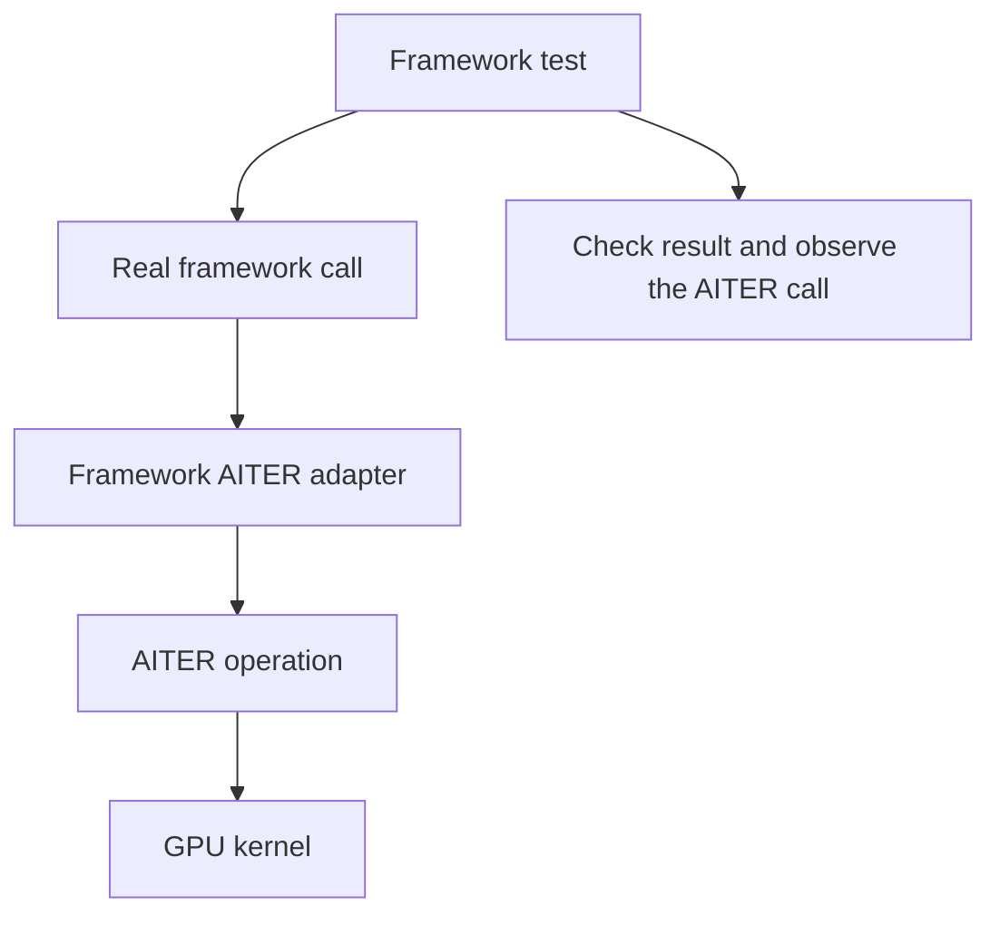

# Framework integration tests

These tests exercise AITER through the applications that use it. Each framework owns a directory so its imports, settings and version assumptions stay together. Helpers shared by several frameworks live in [`common/runtime.py`](common/runtime.py). General GPU markers, model input checks and process helpers live in [`tests/common`](../common/README.md).



| Suite | Evidence |
|---|---|
| [`pytorch/test_rmsnorm.py`](pytorch/test_rmsnorm.py) | FP16 and BF16 PyTorch tensors execute the public normalization entry point and match an FP32 reference |
| [`vllm/operators/`](vllm/operators/README.md) | Real vLLM adapters call AITER for normalization, attention, quantization, GEMM and expert operations; numerical references check the outputs |
| [`vllm/` model and serving areas](vllm/README.md) | Real model weights exercise generation, quantization, multimodal inputs, scheduling, speculation, serving and distributed execution; each area declares its own checks |
| [`sglang/test_rmsnorm.py`](sglang/test_rmsnorm.py) | SGLang selects AITER and its real normalization method produces the expected output and residual |

For a direct development run, install the matching framework first and set its integration flags before Python imports it. Start with a bounded operator group:

```sh
HIP_VISIBLE_DEVICES=0 VLLM_ROCM_USE_AITER=1 python -m pytest tests/frameworks/vllm/operators/normalization/test_rmsnorm.py -q
HIP_VISIBLE_DEVICES=0 SGLANG_USE_AITER=1 python -m pytest tests/frameworks/sglang -q
```

The [vLLM guide](vllm/README.md) explains how to run its model areas and installed-nightly pipeline. AITER flags select the integration; observed calls establish that the selected workload used it. Passing an import test alone does not establish either kernel correctness or model behavior.

Qualification additionally verifies the framework version, GPU environment and installed candidate wheel. Every required selected case must run. The current PyTorch and SGLang groups are small normalization checks; their presence does not imply the model-level coverage implemented for vLLM. Performance measurements have a separate home in [`benchmarks`](../../benchmarks/README.md).
