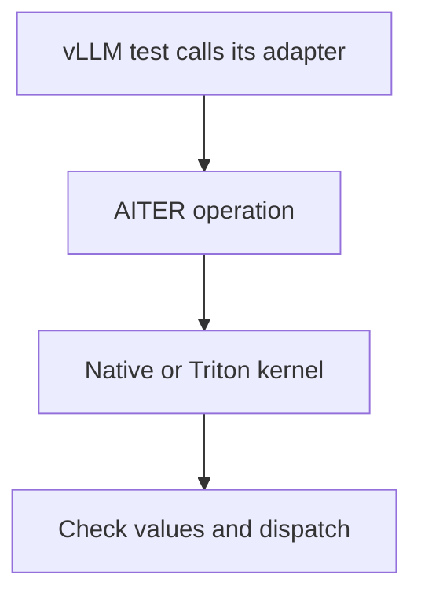

# vLLM operator integration

These tests load vLLM's own AITER adapters. Each numerical test observes a real AITER call or Triton leaf launch and compares the result with independent Torch math. They do not load model weights. A passing case establishes its listed shape, dtype and operation; it does not qualify every model using that operation.

The original 73-case adapter selection remains available. The boundary suites below add over 12,000 individually collected numerical cases. A parameterized case changes an input condition that can affect indexing, rounding or dispatch; it is not another model qualification. The separate import group checks public framework and bridge imports.

| Area | What the checks establish |
| --- | --- |
| [Normalization](normalization/test_rmsnorm.py) | RMSNorm and residual contents agree with independent FP32 math. |
| [FP8 projections](quantization/test_fp8.py) | Group scales, packed layouts, zero groups and blockscale GEMM agree with independent dequantization and rounding bounds. |
| [Fused quantization](quantization/test_fused.py) | Normalization or SiLU multiplication followed by group conversion agrees with the corresponding FP32 expression. |
| [MXFP4 projections](quantization/test_mxfp4.py) | Dynamic and prequantized projection agree with independently decoded E2M1 values and E8M0 scales. |
| [Rotary position](position/test_rotary.py) | Both rotation layouts, offsets and unequal head counts match explicit sine/cosine rotation. |
| [Expert routing](moe/test_routing.py) | Expert IDs, group masks, normalization and scaling match independent softmax or sigmoid routing. |
| [Expert execution](moe/test_experts.py) | Prepared experts match FP64 matrix products and weighted combination; unsupported raw CK layouts fail before launch. |
| [Prefill attention](attention/test_prefill.py) | Packed GQA, causal masks, unequal lengths and FP8 descales match explicit attention math. |

## Boundary suites

These suites concentrate on the conditions small happy-path tests miss. Inputs are deterministic, every valid output element is checked, and padding or caller-owned buffers are checked where the API promises to preserve them. They use the real vLLM adapter and AITER implementation, with independent PyTorch references.

| Area | Cases | Conditions that vary |
| --- | ---: | --- |
| [Normalization](normalization/test_boundaries.py) | 2,048 | Row/vector boundaries, hidden widths, FP16/BF16, residuals, epsilon and all-zero inputs. |
| [Rotary embedding](position/test_boundaries.py) | 2,048 | Token boundaries, unequal Q/K head counts, head widths, both rotation layouts, position offsets and partial rotation. |
| [Expert selection](moe/test_boundaries.py) | 1,920 | Token count, expert count, top-k, three input types and renormalized or original probabilities. |
| [FP8 conversion](quantization/test_fp8_boundaries.py) | 3,584 | Group, tensor and token scales; ordinary/transposed scale storage; zero, tiny, ordinary and large values. |
| [Block-scaled FP8 GEMM](quantization/test_fp8_gemm_boundaries.py) | 512 | Row and column tails, inner dimensions, output precision and independently expanded block scales. |
| [Unified attention](attention/test_unified.py) | 2,320 | Direct kernel and framework backend, scattered cache pages, prefill/decode mixtures, GQA, page/head sizes, FP16/BF16/FP8, windows, soft caps and attention sinks. |
| [FlashAttention](attention/test_flash_boundaries.py) | 432 | Packed/ragged sequences, decode boundaries, head dimensions, FP16/BF16, GQA, noncausal/causal/window masks and softmax scales. |

These seven files contain 12,864 cases, including 16 GPT-OSS attention-geometry cases with simultaneous window/sink behavior and longer segmented caches. A further [128 batched FP8 cases](quantization/test_fp8_batched.py) check fused activation conversion, bias and caller-provided batch-first/token-first output buffers. The total is a collection count, not a promise that every architecture has executed them. Additional MLA, sparse attention and quantized expert tests have their own selectors in the catalog. Use the generated selection inventory to see which profile includes each file:

```bash
python -m ci coverage --client vllm
python -m ci plan --profile vllm-operators --architecture gfx950 \
  --output /tmp/aiter-vllm-operators-plan.json
```

## MLA and quantized model paths

| Area | Cases | What is checked |
| --- | ---: | --- |
| [MLA](attention/mla/test_decode.py) and [sparse MLA](attention/mla/test_sparse.py) | 8 | BF16 and FP8 cache data, ragged/scattered storage, decode and multiple queries, and entirely empty sparse selections. |
| [Alternative FP4 projections](quantization/test_fp4_paths.py) | 8 | FP8 × FP4 projection and BF16 batched projection, with independently decoded weights and scale layouts. |
| [GPT-OSS Triton experts](moe/test_quantized_gpt_oss.py) | 4 | Packed W4A16/W4A8 experts, official shuffle layout, top-k routing, bias and independently expanded weights. |
| [GPT-OSS native CK experts](moe/test_quantized_ck_gpt_oss.py) | 2 | The model's padded dimensions, native stage-one output, exact intermediate FP8 bytes and stage-two weighted reduction. |
| [Additional native FP8 projections](quantization/test_fp8_paths.py) | 13 | Twelve plain/preshuffled CK numerical cases and one check that vLLM rejects an unsupported small preshuffled weight shape. |

Together with the earlier selections, `vllm-operators` contains 13,100 checks. A native expert-stage comparison accounts for the declared intermediate precision; it is not the same criterion as matching the output of a full dequantized Hugging Face model. The real GPT-OSS model and GPQA groups are separate tests.

The optional [hipBLASLt FP8 projection tests](quantization/test_hipblaslt_fp8.py) belong to `vllm-hipblaslt`, outside the default profiles. On the local gfx950/ROCm 7.2.3 environment, the row/channel-scaled preshuffled route reports no available solution. An earlier automatic-tuning attempt exited with code 139; the resulting native bounds fix now produces an informative error and two ordinary test failures. Supported BF16 tuning and a separate process-lifetime regression pass. The optional tests remain strict numerical checks for a compatible environment; neither a skipped case nor another GEMM backend qualifies this route. See the [client guide](../../../../ci/clients/vllm/README.md) for explicit profile selection.



The unified-attention framework entry specifically calls `RocmAiterUnifiedAttentionImpl.forward` with vLLM's packed cache layout, then observes the AITER Triton launch. The direct entry checks the same calculation at AITER's API boundary. Real model tests in the parent areas cover cache creation and updates during generation. The test computes the reference independently; observing a successful call alone does not establish a correct numerical result.

FP8 attention uses an FP8 intermediate for the unnormalized softmax numerator. The prefill tests check a separately rounded reference; paged attention bounds rounding error through the absolute values of V and the softmax denominator, including subnormals and final output rounding. This permits the declared FP8 arithmetic without hiding arbitrary element errors behind an average. Ordinary prefill checks also verify that a missing skip threshold uses the full native calculation, while a positive threshold preserves caller-owned output rows for skipped short sequences.

Run a single area with the environment's installed vLLM and selected AITER:

```bash
VLLM_ROCM_USE_AITER=1 python -m pytest -c tests/pytest.ini \
  tests/frameworks/vllm/operators/position --require-capabilities
```

CI supplies isolated compiler caches and checks package origins. For local C++/HIP edits, use a new `AITER_JIT_DIR` or the explicit rebuild setting: an already loaded native module is not rebuilt merely because its source changed. Keep results outside the checkout.

`requires_arch` restricts an implementation to its declared target, while `requires_capability` expresses a hardware feature such as FP8. CK-based selections remain limited to their declared gfx942/gfx950 targets. A gfx1250 declaration permits bring-up of applicable paths; this machine's gfx950 results do not establish gfx942 or gfx1250 support. See the [hardware guide](../../../common/README.md).

The complete client profile adds import checks and real model/engine tests. Distributed expert parallelism, every checkpoint/export layout, every compiler fusion and every model family remain separate coverage obligations; numerical parameter counts must not conceal them.
