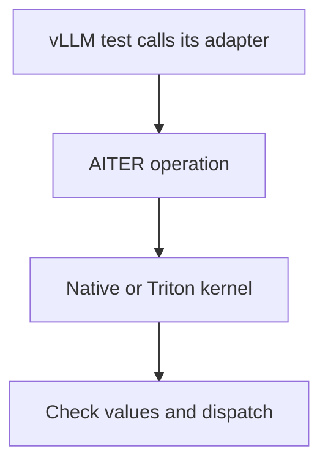

# vLLM operator integration

These tests load vLLM's own AITER adapters. Each numerical test observes a real AITER call or Triton leaf launch and compares the result with independent Torch math. They do not load model weights. A passing case establishes its listed shape, dtype and operation; it does not qualify every model using that operation.

There are 73 cases: 66 numerical checks through vLLM adapters, six unsupported layout checks, and one direct AITER regression for attention skip thresholds. The separate import group checks public framework and bridge imports.

| Area | What the checks establish |
| --- | --- |
| [Normalization](normalization/test_rmsnorm.py) | RMSNorm and residual contents agree with independent FP32 math. |
| [FP8 projections](quantization/test_fp8.py) | Group scales, packed layouts, zero groups and blockscale GEMM agree with independent dequantization and rounding bounds. |
| [Fused quantization](quantization/test_fused.py) | Normalization or SiLU multiplication followed by group conversion agrees with the corresponding FP32 expression. |
| [MXFP4 projections](quantization/test_mxfp4.py) | Dynamic and prequantized projection agree with independently decoded E2M1 values and E8M0 scales. |
| [Rotary position](position/test_rotary.py) | Both rotation layouts, offsets and unequal head counts match explicit sine/cosine rotation. |
| [Expert routing](moe/test_routing.py) | Expert IDs, group masks, normalization and scaling match independent softmax or sigmoid routing. |
| [Expert execution](moe/test_experts.py) | Prepared experts match FP64 matrix products and weighted combination; unsupported raw CK layouts fail before launch. |
| [Prefill attention](attention/test_prefill.py) | Packed GQA, causal masks, unequal lengths and FP8 descales match explicit attention math. |



The test computes the reference independently; observing a successful call alone does not establish a correct numerical result.

FP8 attention uses an FP8 intermediate for the unnormalized softmax numerator. Its tests check that arithmetic against an independent rounded-numerator reference and also bound its error against full FP32 softmax. They do not apply FP16 error assumptions to an FP8 operation. Ordinary prefill checks also verify that a missing skip threshold uses the full native calculation, while a positive threshold preserves caller-owned output rows for skipped short sequences.

Run a single area with the environment's installed vLLM and selected AITER:

```bash
VLLM_ROCM_USE_AITER=1 python -m pytest -c tests/pytest.ini \
  tests/frameworks/vllm/operators/position --require-capabilities
```

CI supplies isolated compiler caches and checks package origins. The complete client profile adds import checks and model/engine tests owned by their separate areas. Paged cache updates, distributed expert parallelism, every MoE quantization layout, and compiler fusion coverage are separate work; the tests here do not stand in for them.