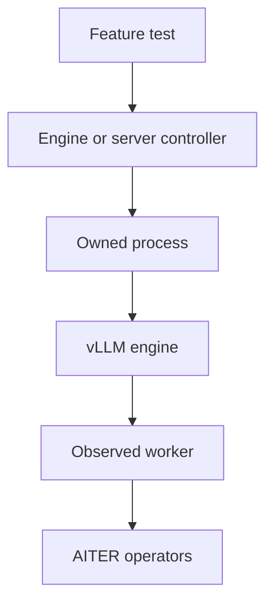
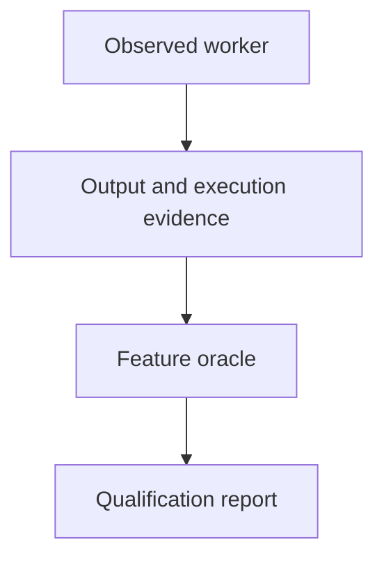

# Real vLLM model and server tests

These tests run real checkpoint weights through vLLM and inspect the workers that execute AITER. Each feature owns its input and assertions. The shared runtime owns process lifetime, engine construction, HTTP transport and evidence. The [upstream selection guide](../../../../ci/clients/vllm/upstream/README.md) explains the Buildkite areas used to choose this bounded port and the families that remain outside its scope.

## Runtime ownership

`protocol.py` validates bounded engine settings and batches. `engine.py` executes those batches through the public LLM API. `server.py` starts the real OpenAI API server on 127.0.0.1 and retains each HTTP request and response. `reference.py` provides an independent Transformers eager-attention oracle. Feature tests in `entrypoints/`, `evaluation/`, `models/`, `generation/`, `attention/`, `execution/`, `distributed/` and `quantization/` decide what observable behavior must hold.





`ObservedWorker` installs operation and Triton-launch hooks before model loading. Every generation batch must show successful AITER normalization and unified-attention execution on each expected rank. Graph counts include only replay of a known successful capture containing those operations. Scheduling records come from the actual worker `execute_model` call and retain each request's token count. TP2 requires distinct ranks, processes and device UUIDs; it does not claim that AITER implements the collective transport.

The server uses vLLM's string-method observation RPC only on its loopback listener. Its public completion/chat requests run through the normal HTTP frontend and engine. Worker observations are reset after readiness, so warmup calls cannot satisfy the generation gate. Every child process group is terminated and reaped on success, failure or timeout, with execution evidence retained. The server's normal shutdown signal is recorded separately from the test outcome.

## Inputs and numerical contracts

The single [client model registry](../../../../ci/clients/vllm/models.json) owns exact revisions, file sizes and hashes for real BF16 checkpoints: Llama-3.2-1B-Instruct, Qwen2.5-VL-3B-Instruct and Qwen3-1.7B. Tests and benchmarks share that registry. Model views contain only declared files, copied and verified before use, then rehashed afterward. Tests never download inputs implicitly.

The Llama checkpoint is distributed by Unsloth at revision `5a8abab4a5d6f164389b1079fb721cfab8d7126c` under the Llama 3.2 community license. Qwen2.5-VL uses revision `66285546d2b821cf421d4f5eb2576359d3770cd3`; Qwen3-1.7B uses `70d244cc86ccca08cf5af4e1e306ecf908b1ad5e`. Qwen3-1.7B uses Apache 2.0. Qwen2.5-VL-3B uses the [Qwen Research License](https://huggingface.co/Qwen/Qwen2.5-VL-3B-Instruct/blob/66285546d2b821cf421d4f5eb2576359d3770cd3/LICENSE). Admitted Qwen views retain the exact upstream license files. The Unsloth checkpoint provides its license identifier in its model card, which the Llama view retains. The registry identifies the exact repositories; model licenses remain the upstream publishers' terms.

The [GSM8K fixture](../evaluation/fixtures/gsm8k.json) owns the evaluation data and policy. It records the MIT-licensed `openai/gsm8k` revision `740312add88f781978c0658806c59bc2815b9866`, both original Parquet hashes, row indices and four training demonstrations. Daily execution uses test rows 0–31. Extended execution uses disjoint rows 32–159, reserved from threshold calibration. Answers must end with an unambiguous `#### number`; missing, truncated and wrong answers remain in the denominator. Both profiles require at least 50% exact answers with greedy non-thinking generation capped at 256 tokens. This is a bounded regression floor, calibrated from the initial 22/32 development result; it is not a full-dataset model score or a confidence interval.

Qwen3 comparison requires exact greedy token sequences and checks every recorded prompt-token log probability against Transformers using eager attention and the same BF16 weights. The maximum absolute log-probability error is 0.75 and its mean is 0.06. These bounds account for observed cross-engine BF16 variance: an independent non-AITER vLLM baseline differed from Transformers by 0.5703 maximum and 0.03931 mean. The initial stricter comparison failed and remains in the development evidence. Prompt token alignment, missing entries, NaN values and large errors hidden by a mean are rejected. Prompts are scheduled individually to avoid adding batch variance to the reference comparison.

Online quantization uses `fp8_per_channel`. The selected vLLM per-tensor `fp8` route does not establish AITER linear execution for these weights, so it is not used as a substitute. Tests inspect actual FP8 projection parameters and AITER GEMM calls. The extended likelihood check bounds all 82 scored prompt-token errors by 1.0 maximum and 0.15 mean against BF16. It makes no general BF16/FP8 token-equivalence or model-quality claim. The optional hipBLASLt linear path is disabled because the selected ROCm environment lacks solutions for some preshuffled rowwise profiling shapes; the normal vLLM AITER selector still executes the observed linear kernels.

## Run locally

Provision inputs before selecting required tests:

```bash
export HF_HUB_CACHE=/path/to/owned/model-cache
PYTHONPATH=tests python -m common.models \
  --manifest ci/clients/vllm/models.json \
  --download --cache-dir "$HF_HUB_CACHE" \
  --output /tmp/aiter-model-receipts.json

python -m pytest -c tests/pytest.ini \
  tests/frameworks/vllm/entrypoints \
  tests/frameworks/vllm/evaluation/test_gsm8k.py::test_gsm8k_daily_32 \
  --run-e2e --require-capabilities \
  --e2e-evidence-dir /tmp/aiter-vllm-evidence
```

Broad developer discovery can skip unavailable architecture, framework or model prerequisites. Selected qualification passes `--require-capabilities`, so missing required inputs fail. Markers collect without importing Torch, AITER or vLLM. Pytest adds only the test suite to its search path. Managed subprocesses explicitly select the candidate package and reviewed control/test roots; installed qualification copies only CI controls and tests, never a source AITER package. Every worker still validates its selected package origin and the hashes of loaded Python and native modules.

Use the [qualification guide](../../../../ci/README.md) for sealed source/wheel plans and the daily/extended profiles. Evidence includes exact model receipts, engine options, HTTP transcripts, generated tokens, prompt likelihoods, per-rank package identities, successful AITER calls and process status. Failed development attempts remain separate from later accepted runs. The previous 81-case rolling-nightly result remains bound to its original wheel and controls; it does not qualify this expanded port.
